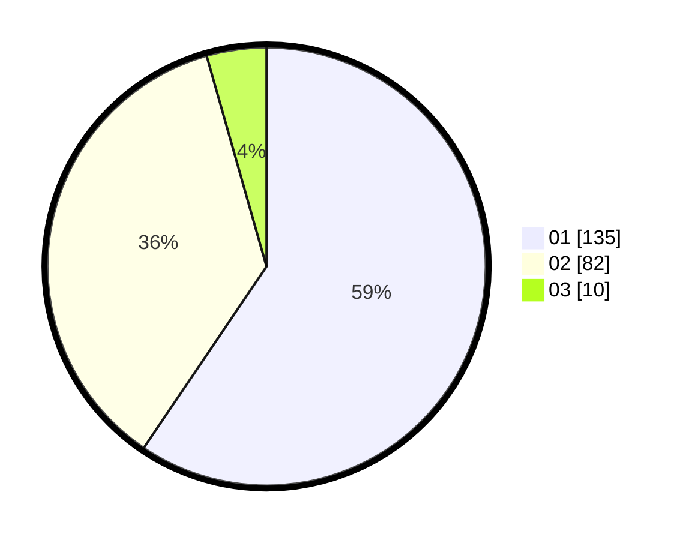

# Hasil

Hasil perolehan suara paslon dapat dilihat pada file paslon-01.txt, paslon-02.txt, dan paslon-03.txt.

Jika tidak ada, artinya data tersebut belum ada pada SIREKAP.

## Perolehan Suara

 * Paslon 01: **135**.
 * Paslon 02: **82**.
 * Paslon 03: **10**.

## Foto C Plano

https://sirekap-obj-formc.kpu.go.id/c025/pemilu/ppwp/31/71/07/10/05/3171071005093-20240216-144755--57cae39f-690b-490c-8b87-e22e2511713a.jpg

https://sirekap-obj-formc.kpu.go.id/c025/pemilu/ppwp/31/71/07/10/05/3171071005093-20240216-144756--7c745011-fa79-4f33-b363-2b84eb0b848d.jpg

https://sirekap-obj-formc.kpu.go.id/c025/pemilu/ppwp/31/71/07/10/05/3171071005093-20240216-144756--26a6e739-e688-4b2b-b903-826bde570f58.jpg

## DATA PEMILIH TETAP

Jumlah pemilih dalam DPT: **274**.
 * L: **130**.
 * P: **144**.

## DATA PENGGUNA HAK PILIH

Jumlah pengguna hak pilih dalam DPT: **224**.
 * L: **109**.
 * P: **115**.

Jumlah pengguna hak pilih dalam DPTb: **3**.
 * L: **2**.
 * P: **1**.

Jumlah pengguna hak pilih dalam DPK: **1**.
 * L: **0**.
 * P: **1**.

Jumlah pengguna hak pilih: **228**.
 * L: **111**.
 * P: **117**.

## JUMLAH SUARA SAH DAN TIDAK SAH

JUMLAH SELURUH SUARA SAH: **227**.

JUMLAH SUARA TIDAK SAH: **1**.

JUMLAH SELURUH SUARA SAH DAN SUARA TIDAK SAH: **228**.
