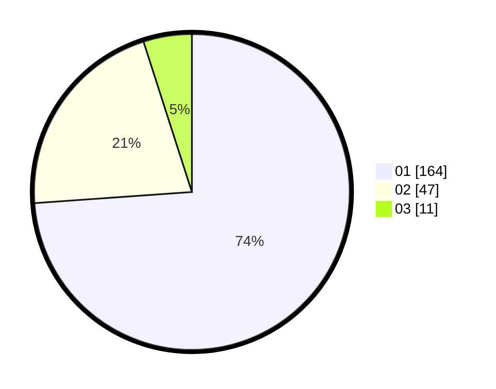

# Hasil

Hasil perolehan suara paslon dapat dilihat pada file paslon-01.txt, paslon-02.txt, dan paslon-03.txt.

Jika tidak ada, artinya data tersebut belum ada pada SIREKAP.

## Perolehan Suara

 * Paslon 01: **164**.
 * Paslon 02: **47**.
 * Paslon 03: **11**.

## Foto C Plano

https://sirekap-obj-formc.kpu.go.id/1422/pemilu/ppwp/31/71/07/10/05/3171071005096-20240215-005946--6e5bb115-fc91-4451-bf1c-1e46d1acca66.jpg

https://sirekap-obj-formc.kpu.go.id/1422/pemilu/ppwp/31/71/07/10/05/3171071005096-20240215-010223--84d9526a-b7ab-45cc-9f13-eb54568e2e3f.jpg

https://sirekap-obj-formc.kpu.go.id/1422/pemilu/ppwp/31/71/07/10/05/3171071005096-20240215-010445--9074e684-63b5-48b7-b1e2-243f6b9a1009.jpg
