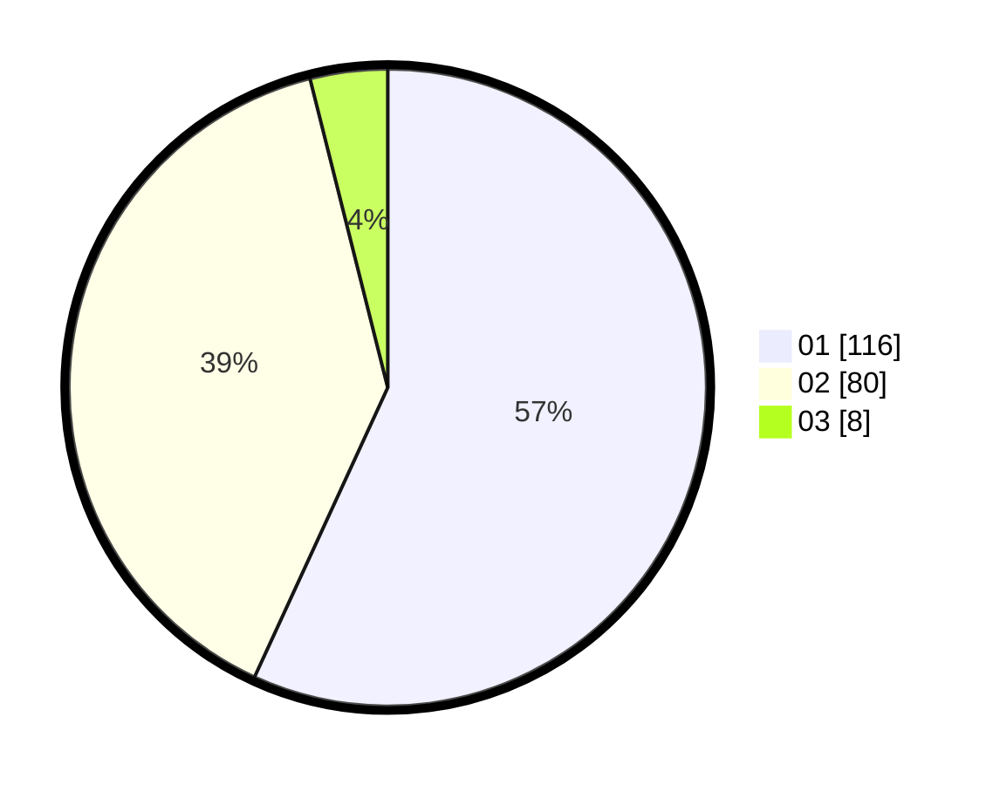

# Hasil

Hasil perolehan suara paslon dapat dilihat pada file paslon-01.txt, paslon-02.txt, dan paslon-03.txt.

Jika tidak ada, artinya data tersebut belum ada pada SIREKAP.

## Perolehan Suara

 * Paslon 01: **116**.
 * Paslon 02: **80**.
 * Paslon 03: **8**.

## Foto C Plano

https://sirekap-obj-formc.kpu.go.id/d823/pemilu/ppwp/31/71/07/10/05/3171071005102-20240216-153244--3b6910d9-2d93-4dd3-a088-fb47248657dd.jpg

https://sirekap-obj-formc.kpu.go.id/d823/pemilu/ppwp/31/71/07/10/05/3171071005102-20240216-153246--d8c08ad0-5bdd-427d-b213-9e82712527af.jpg

https://sirekap-obj-formc.kpu.go.id/d823/pemilu/ppwp/31/71/07/10/05/3171071005102-20240216-153245--147a260c-ca7e-4c55-b7c1-09c16849da63.jpg

## DATA PEMILIH TETAP

Jumlah pemilih dalam DPT: **205**.
 * L: **99**.
 * P: **106**.

## DATA PENGGUNA HAK PILIH

Jumlah pengguna hak pilih dalam DPT: **205**.
 * L: **99**.
 * P: **106**.

Jumlah pengguna hak pilih dalam DPTb: **0**.
 * L: **0**.
 * P: **0**.

Jumlah pengguna hak pilih dalam DPK: **1**.
 * L: **1**.
 * P: **0**.

Jumlah pengguna hak pilih: **206**.
 * L: **100**.
 * P: **106**.

## JUMLAH SUARA SAH DAN TIDAK SAH

JUMLAH SELURUH SUARA SAH: **204**.

JUMLAH SUARA TIDAK SAH: **2**.

JUMLAH SELURUH SUARA SAH DAN SUARA TIDAK SAH: **206**.
