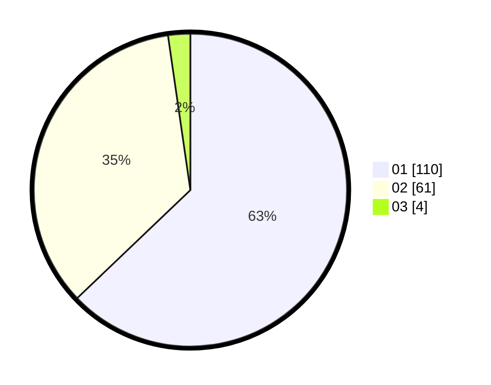

# Hasil

Hasil perolehan suara paslon dapat dilihat pada file paslon-01.txt, paslon-02.txt, dan paslon-03.txt.

Jika tidak ada, artinya data tersebut belum ada pada SIREKAP.

## Perolehan Suara

 * Paslon 01: **110**.
 * Paslon 02: **61**.
 * Paslon 03: **4**.

## Foto C Plano

https://sirekap-obj-formc.kpu.go.id/9d4c/pemilu/ppwp/31/71/07/10/05/3171071005106-20240214-231426--d16809f0-35d4-4b49-a340-1b355f4b46f3.jpg

https://sirekap-obj-formc.kpu.go.id/9d4c/pemilu/ppwp/31/71/07/10/05/3171071005106-20240214-215655--8dabb214-a22e-49a9-969f-f38ea896f495.jpg

https://sirekap-obj-formc.kpu.go.id/9d4c/pemilu/ppwp/31/71/07/10/05/3171071005106-20240214-231521--447f71ac-5d4f-4f9b-b8d5-2d7cfd5baf58.jpg

## DATA PEMILIH TETAP

Jumlah pemilih dalam DPT: **250**.
 * L: **125**.
 * P: **125**.

## DATA PENGGUNA HAK PILIH

Jumlah pengguna hak pilih dalam DPT: **174**.
 * L: **85**.
 * P: **89**.

Jumlah pengguna hak pilih dalam DPTb: **0**.
 * L: **0**.
 * P: **0**.

Jumlah pengguna hak pilih dalam DPK: **2**.
 * L: **1**.
 * P: **1**.

Jumlah pengguna hak pilih: **176**.
 * L: **86**.
 * P: **90**.

## JUMLAH SUARA SAH DAN TIDAK SAH

JUMLAH SELURUH SUARA SAH: **175**.

JUMLAH SUARA TIDAK SAH: **1**.

JUMLAH SELURUH SUARA SAH DAN SUARA TIDAK SAH: **176**.
