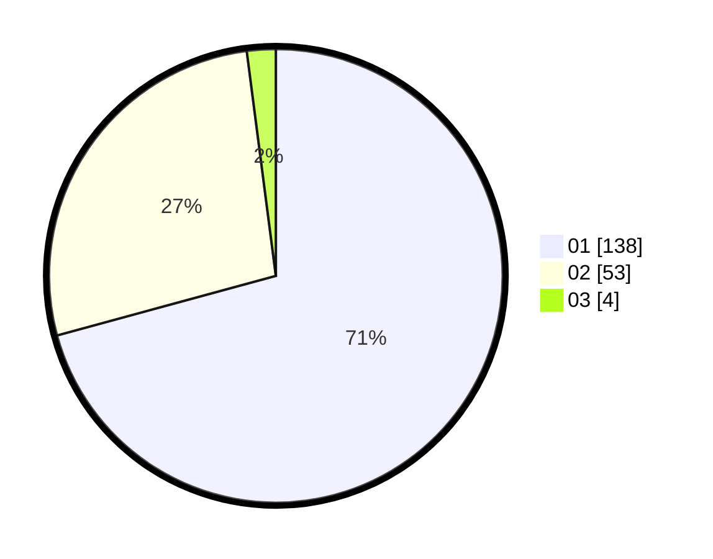

# Hasil

Hasil perolehan suara paslon dapat dilihat pada file paslon-01.txt, paslon-02.txt, dan paslon-03.txt.

Jika tidak ada, artinya data tersebut belum ada pada SIREKAP.

## Perolehan Suara

 * Paslon 01: **138**.
 * Paslon 02: **53**.
 * Paslon 03: **4**.

## Foto C Plano

https://sirekap-obj-formc.kpu.go.id/431d/pemilu/ppwp/31/71/07/10/05/3171071005107-20240216-145022--9d5b9dfd-3292-4437-a5e0-f1aa5c1ba0a1.jpg

https://sirekap-obj-formc.kpu.go.id/431d/pemilu/ppwp/31/71/07/10/05/3171071005107-20240216-145024--7d364b46-7d97-497d-ab4d-c0f342c2e51e.jpg

https://sirekap-obj-formc.kpu.go.id/431d/pemilu/ppwp/31/71/07/10/05/3171071005107-20240216-145023--b41e370e-ccf1-43f2-a7f5-1f79ce449032.jpg

## DATA PEMILIH TETAP

Jumlah pemilih dalam DPT: **266**.
 * L: **129**.
 * P: **137**.

## DATA PENGGUNA HAK PILIH

Jumlah pengguna hak pilih dalam DPT: **191**.
 * L: **91**.
 * P: **100**.

Jumlah pengguna hak pilih dalam DPTb: **0**.
 * L: **0**.
 * P: **0**.

Jumlah pengguna hak pilih dalam DPK: **4**.
 * L: **2**.
 * P: **2**.

Jumlah pengguna hak pilih: **195**.
 * L: **93**.
 * P: **102**.

## JUMLAH SUARA SAH DAN TIDAK SAH

JUMLAH SELURUH SUARA SAH: **195**.

JUMLAH SUARA TIDAK SAH: **0**.

JUMLAH SELURUH SUARA SAH DAN SUARA TIDAK SAH: **195**.
