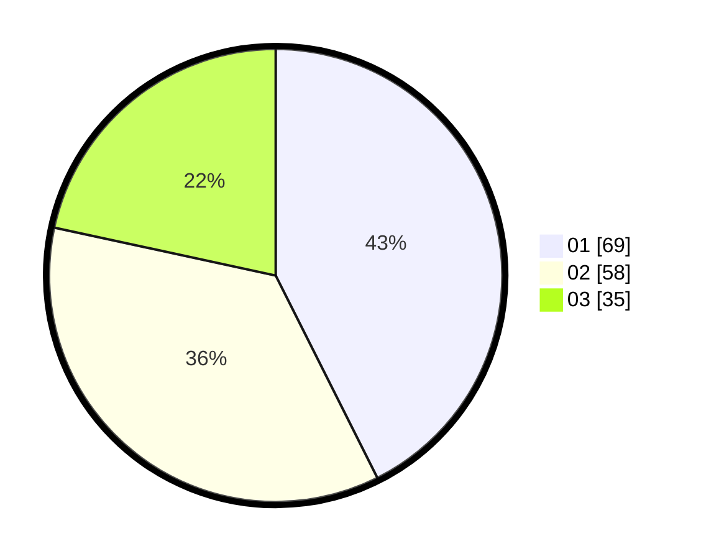

# Hasil

Hasil perolehan suara paslon dapat dilihat pada file paslon-01.txt, paslon-02.txt, dan paslon-03.txt.

Jika tidak ada, artinya data tersebut belum ada pada SIREKAP.

## Perolehan Suara

 * Paslon 01: **69**.
 * Paslon 02: **58**.
 * Paslon 03: **35**.

## Foto C Plano

https://sirekap-obj-formc.kpu.go.id/7bce/pemilu/ppwp/31/71/07/10/06/3171071006002-20240214-202719--a2ea328b-c57f-4cdf-81a6-76452272913b.jpg

https://sirekap-obj-formc.kpu.go.id/7bce/pemilu/ppwp/31/71/07/10/06/3171071006002-20240214-202741--9a90ca34-1273-4df9-b040-31cb5388e6ba.jpg

https://sirekap-obj-formc.kpu.go.id/7bce/pemilu/ppwp/31/71/07/10/06/3171071006002-20240214-202751--3be49635-49dc-48b9-82df-67fcae62ca95.jpg

## DATA PEMILIH TETAP

Jumlah pemilih dalam DPT: **251**.
 * L: **117**.
 * P: **134**.

## DATA PENGGUNA HAK PILIH

Jumlah pengguna hak pilih dalam DPT: **155**.
 * L: **65**.
 * P: **90**.

Jumlah pengguna hak pilih dalam DPTb: **4**.
 * L: **1**.
 * P: **3**.

Jumlah pengguna hak pilih dalam DPK: **3**.
 * L: **1**.
 * P: **2**.

Jumlah pengguna hak pilih: **162**.
 * L: **67**.
 * P: **95**.

## JUMLAH SUARA SAH DAN TIDAK SAH

JUMLAH SELURUH SUARA SAH: **162**.

JUMLAH SUARA TIDAK SAH: **95**.

JUMLAH SELURUH SUARA SAH DAN SUARA TIDAK SAH: **257**.
