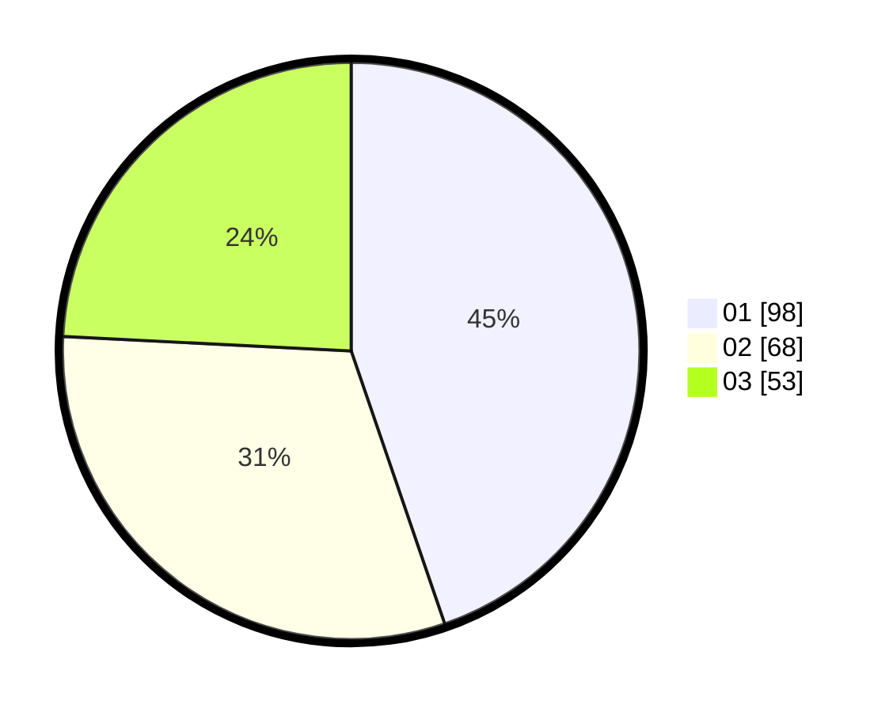

# Hasil

Hasil perolehan suara paslon dapat dilihat pada file paslon-01.txt, paslon-02.txt, dan paslon-03.txt.

Jika tidak ada, artinya data tersebut belum ada pada SIREKAP.

## Perolehan Suara

 * Paslon 01: **98**.
 * Paslon 02: **68**.
 * Paslon 03: **53**.

## Foto C Plano

https://sirekap-obj-formc.kpu.go.id/45cd/pemilu/ppwp/31/71/07/10/06/3171071006008-20240214-194621--2e2b5e6d-e570-4544-8c1d-e739223bb1a5.jpg

https://sirekap-obj-formc.kpu.go.id/45cd/pemilu/ppwp/31/71/07/10/06/3171071006008-20240214-222615--a0354bcc-3f61-417d-89d2-9004fb6a43fd.jpg

https://sirekap-obj-formc.kpu.go.id/45cd/pemilu/ppwp/31/71/07/10/06/3171071006008-20240214-222720--c3b75db5-ce7f-4705-930d-5c7eecdcc7ce.jpg

## DATA PEMILIH TETAP

Jumlah pemilih dalam DPT: **275**.
 * L: **136**.
 * P: **139**.

## DATA PENGGUNA HAK PILIH

Jumlah pengguna hak pilih dalam DPT: **208**.
 * L: **100**.
 * P: **108**.

Jumlah pengguna hak pilih dalam DPTb: **13**.
 * L: **2**.
 * P: **11**.

Jumlah pengguna hak pilih dalam DPK: **1**.
 * L: **1**.
 * P: **0**.

Jumlah pengguna hak pilih: **222**.
 * L: **103**.
 * P: **119**.

## JUMLAH SUARA SAH DAN TIDAK SAH

JUMLAH SELURUH SUARA SAH: **219**.

JUMLAH SUARA TIDAK SAH: **3**.

JUMLAH SELURUH SUARA SAH DAN SUARA TIDAK SAH: **222**.
