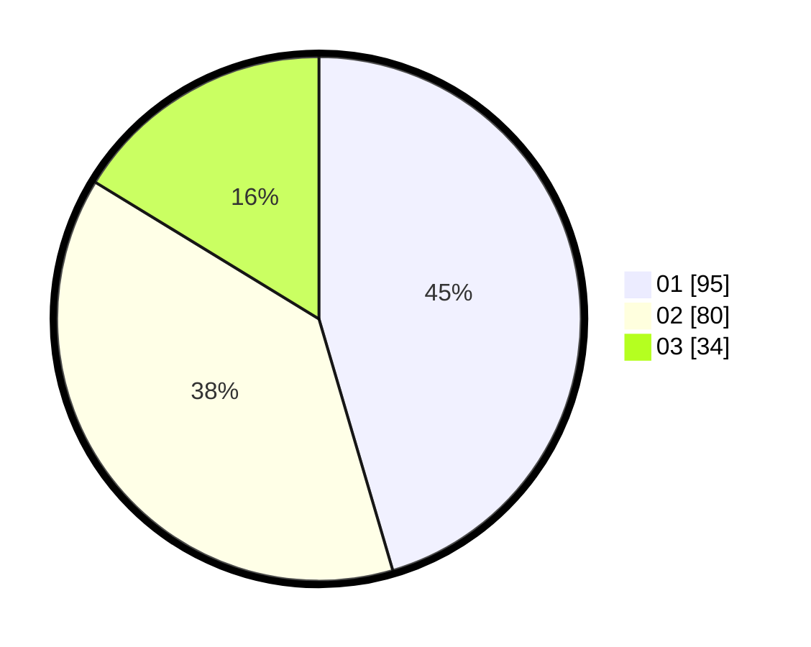

# Hasil

Hasil perolehan suara paslon dapat dilihat pada file paslon-01.txt, paslon-02.txt, dan paslon-03.txt.

Jika tidak ada, artinya data tersebut belum ada pada SIREKAP.

## Perolehan Suara

 * Paslon 01: **95**.
 * Paslon 02: **80**.
 * Paslon 03: **34**.

## Foto C Plano

https://sirekap-obj-formc.kpu.go.id/5c57/pemilu/ppwp/31/71/07/10/06/3171071006009-20240214-201528--21fe6ea0-0ef9-4d8e-b4c6-5afbe79e0bf0.jpg

https://sirekap-obj-formc.kpu.go.id/5c57/pemilu/ppwp/31/71/07/10/06/3171071006009-20240214-215808--4126e685-f0c5-458f-a990-3011eb4c9cbd.jpg
