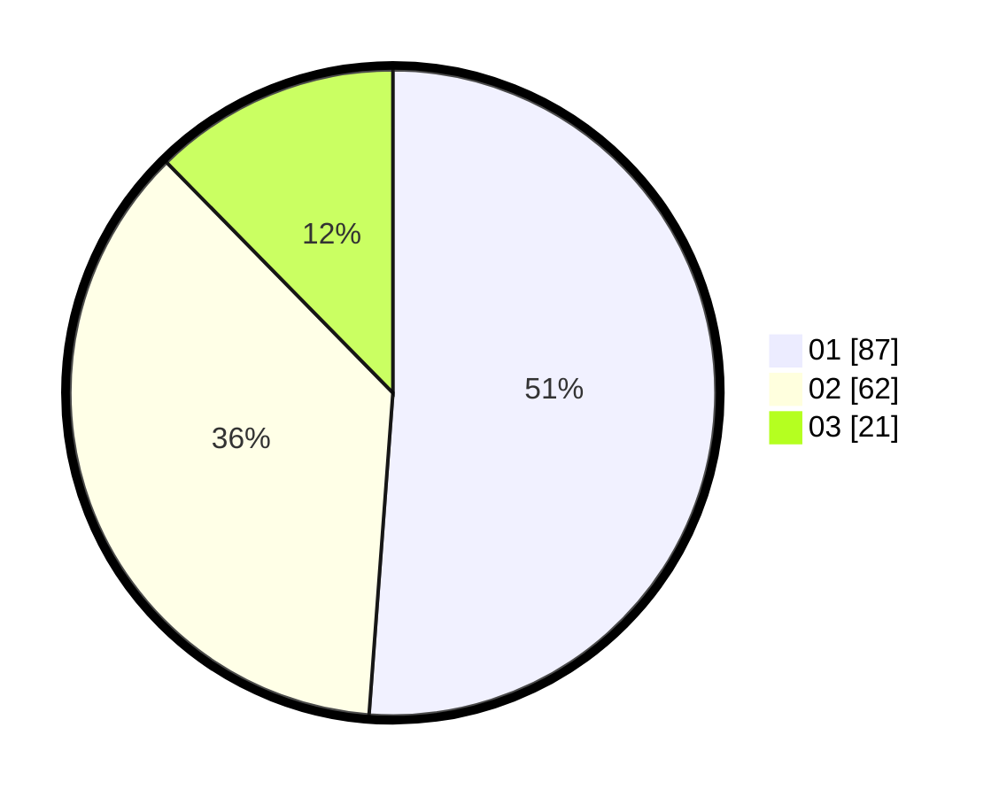

# Hasil

Hasil perolehan suara paslon dapat dilihat pada file paslon-01.txt, paslon-02.txt, dan paslon-03.txt.

Jika tidak ada, artinya data tersebut belum ada pada SIREKAP.

## Perolehan Suara

 * Paslon 01: **87**.
 * Paslon 02: **62**.
 * Paslon 03: **21**.

## Foto C Plano

https://sirekap-obj-formc.kpu.go.id/becb/pemilu/ppwp/31/71/07/10/06/3171071006012-20240214-212115--dbba5a6a-d179-41b7-9c8c-835a2cf2ce1f.jpg

https://sirekap-obj-formc.kpu.go.id/becb/pemilu/ppwp/31/71/07/10/06/3171071006012-20240214-215357--4840e81d-8e31-4ff7-8c62-c1c536a7ccd5.jpg

https://sirekap-obj-formc.kpu.go.id/becb/pemilu/ppwp/31/71/07/10/06/3171071006012-20240214-214234--474f7c2e-88ea-4dbb-a2a2-edd3ef588c23.jpg
