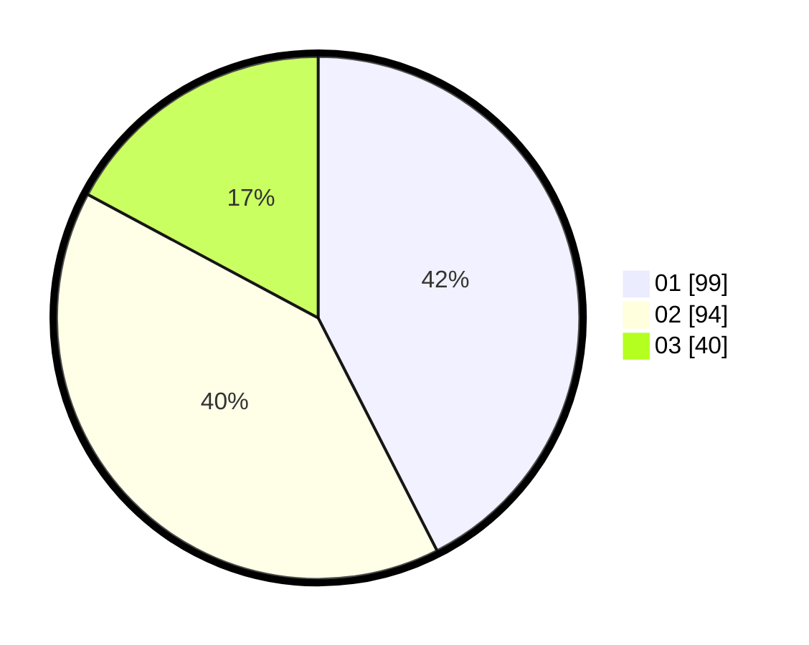

# Hasil

Hasil perolehan suara paslon dapat dilihat pada file paslon-01.txt, paslon-02.txt, dan paslon-03.txt.

Jika tidak ada, artinya data tersebut belum ada pada SIREKAP.

## Perolehan Suara

 * Paslon 01: **99**.
 * Paslon 02: **94**.
 * Paslon 03: **40**.

## Foto C Plano

https://sirekap-obj-formc.kpu.go.id/e188/pemilu/ppwp/31/71/07/10/06/3171071006013-20240216-100036--6396edcc-a4e4-431b-91b5-e161bdd560f8.jpg

https://sirekap-obj-formc.kpu.go.id/e188/pemilu/ppwp/31/71/07/10/06/3171071006013-20240216-100037--316618d1-d315-444f-947c-cdc576cb0f64.jpg

https://sirekap-obj-formc.kpu.go.id/e188/pemilu/ppwp/31/71/07/10/06/3171071006013-20240216-100036--aa775393-5958-45e6-8da3-f69792a721a7.jpg

## DATA PEMILIH TETAP

Jumlah pemilih dalam DPT: **275**.
 * L: **135**.
 * P: **140**.

## DATA PENGGUNA HAK PILIH

Jumlah pengguna hak pilih dalam DPT: **213**.
 * L: **102**.
 * P: **111**.

Jumlah pengguna hak pilih dalam DPTb: **16**.
 * L: **2**.
 * P: **14**.

Jumlah pengguna hak pilih dalam DPK: **7**.
 * L: **1**.
 * P: **6**.

Jumlah pengguna hak pilih: **236**.
 * L: **105**.
 * P: **131**.

## JUMLAH SUARA SAH DAN TIDAK SAH

JUMLAH SELURUH SUARA SAH: **233**.

JUMLAH SUARA TIDAK SAH: **3**.

JUMLAH SELURUH SUARA SAH DAN SUARA TIDAK SAH: **236**.
