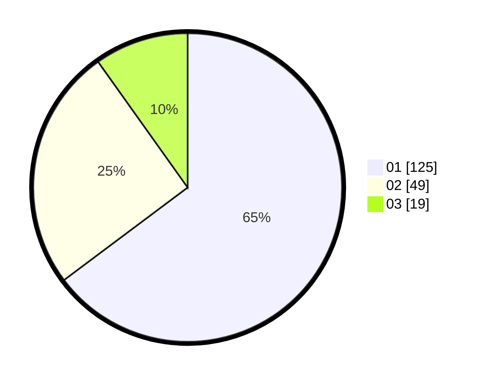

# Hasil

Hasil perolehan suara paslon dapat dilihat pada file paslon-01.txt, paslon-02.txt, dan paslon-03.txt.

Jika tidak ada, artinya data tersebut belum ada pada SIREKAP.

## Perolehan Suara

 * Paslon 01: **125**.
 * Paslon 02: **49**.
 * Paslon 03: **19**.

## Foto C Plano

https://sirekap-obj-formc.kpu.go.id/6b71/pemilu/ppwp/31/71/07/10/06/3171071006015-20240216-135854--64532519-cfbe-4940-8aae-c8c4a511ba43.jpg

https://sirekap-obj-formc.kpu.go.id/6b71/pemilu/ppwp/31/71/07/10/06/3171071006015-20240216-135855--2ca01601-ffc0-4800-933d-c36e513cb903.jpg

https://sirekap-obj-formc.kpu.go.id/6b71/pemilu/ppwp/31/71/07/10/06/3171071006015-20240216-135854--fbd3c839-5f20-47b9-8f4f-ab1976ba7a61.jpg

## DATA PEMILIH TETAP

Jumlah pemilih dalam DPT: **252**.
 * L: **111**.
 * P: **136**.

## DATA PENGGUNA HAK PILIH

Jumlah pengguna hak pilih dalam DPT: **180**.
 * L: **84**.
 * P: **96**.

Jumlah pengguna hak pilih dalam DPTb: **13**.
 * L: **5**.
 * P: **8**.

Jumlah pengguna hak pilih dalam DPK: **3**.
 * L: **2**.
 * P: **1**.

Jumlah pengguna hak pilih: **196**.
 * L: **91**.
 * P: **105**.

## JUMLAH SUARA SAH DAN TIDAK SAH

JUMLAH SELURUH SUARA SAH: **193**.

JUMLAH SUARA TIDAK SAH: **3**.

JUMLAH SELURUH SUARA SAH DAN SUARA TIDAK SAH: **196**.
