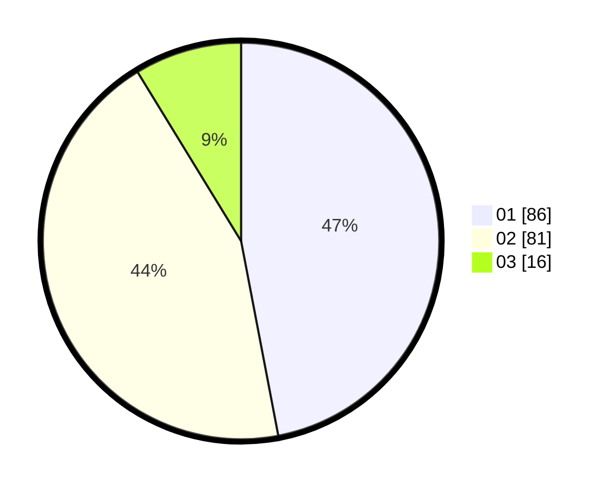

# Hasil

Hasil perolehan suara paslon dapat dilihat pada file paslon-01.txt, paslon-02.txt, dan paslon-03.txt.

Jika tidak ada, artinya data tersebut belum ada pada SIREKAP.

## Perolehan Suara

 * Paslon 01: **86**.
 * Paslon 02: **81**.
 * Paslon 03: **16**.

## Foto C Plano

https://sirekap-obj-formc.kpu.go.id/38de/pemilu/ppwp/31/71/07/10/06/3171071006017-20240215-013019--e30d5861-34af-4fe6-8db4-a06634134ddb.jpg

https://sirekap-obj-formc.kpu.go.id/38de/pemilu/ppwp/31/71/07/10/06/3171071006017-20240215-013126--709a0b61-f7d1-4ca5-8c4e-37307b4a8b06.jpg

https://sirekap-obj-formc.kpu.go.id/38de/pemilu/ppwp/31/71/07/10/06/3171071006017-20240215-013234--e5b77e6c-2028-4153-9edf-faedce13be35.jpg
