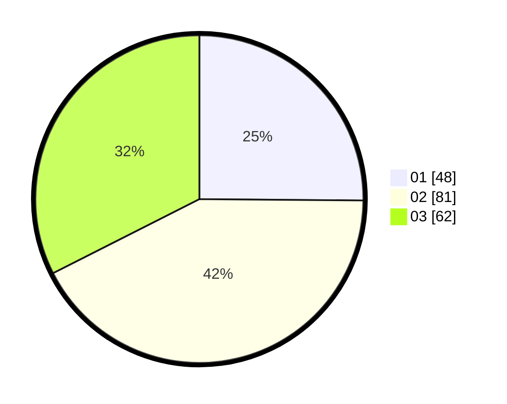

# Hasil

Hasil perolehan suara paslon dapat dilihat pada file paslon-01.txt, paslon-02.txt, dan paslon-03.txt.

Jika tidak ada, artinya data tersebut belum ada pada SIREKAP.

## Perolehan Suara

 * Paslon 01: **48**.
 * Paslon 02: **81**.
 * Paslon 03: **62**.

## Foto C Plano

https://sirekap-obj-formc.kpu.go.id/bf52/pemilu/ppwp/31/71/07/10/06/3171071006026-20240215-140031--d92f8d7a-36db-49b5-b232-9145c27af49c.jpg

https://sirekap-obj-formc.kpu.go.id/bf52/pemilu/ppwp/31/71/07/10/06/3171071006026-20240215-140052--bce5ee78-4218-4320-8667-b0167ca0f352.jpg

https://sirekap-obj-formc.kpu.go.id/bf52/pemilu/ppwp/31/71/07/10/06/3171071006026-20240215-140042--7f66055b-b5f1-42da-b786-8f455fac174b.jpg

## DATA PEMILIH TETAP

Jumlah pemilih dalam DPT: **242**.
 * L: **119**.
 * P: **123**.

## DATA PENGGUNA HAK PILIH

Jumlah pengguna hak pilih dalam DPT: **187**.
 * L: **91**.
 * P: **96**.

Jumlah pengguna hak pilih dalam DPTb: **4**.
 * L: **1**.
 * P: **3**.

Jumlah pengguna hak pilih dalam DPK: **1**.
 * L: **1**.
 * P: **0**.

Jumlah pengguna hak pilih: **192**.
 * L: **93**.
 * P: **99**.

## JUMLAH SUARA SAH DAN TIDAK SAH

JUMLAH SELURUH SUARA SAH: **191**.

JUMLAH SUARA TIDAK SAH: **1**.

JUMLAH SELURUH SUARA SAH DAN SUARA TIDAK SAH: **192**.
