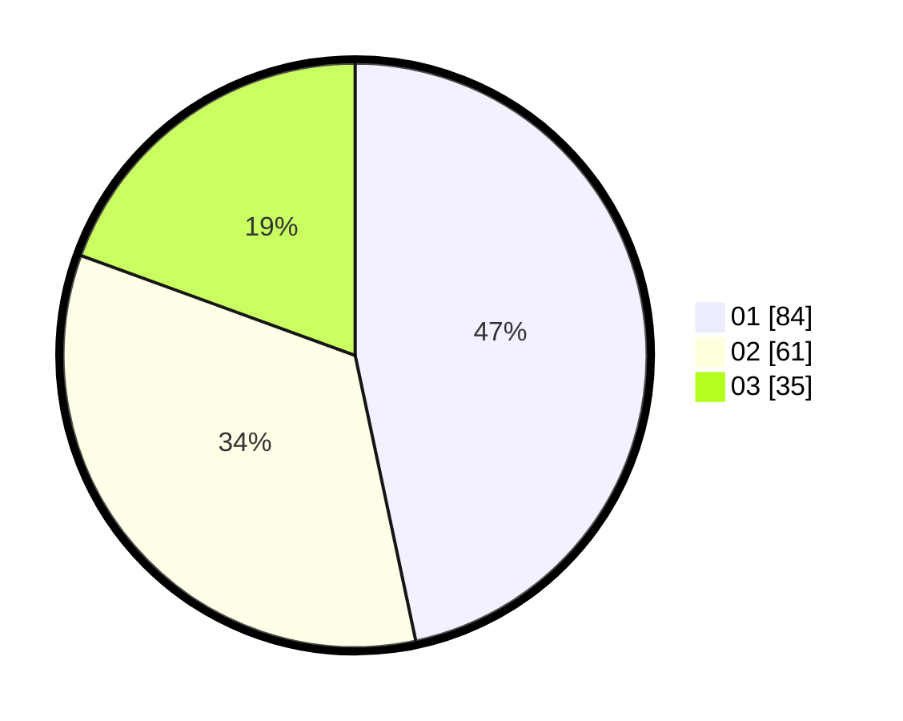

# Hasil

Hasil perolehan suara paslon dapat dilihat pada file paslon-01.txt, paslon-02.txt, dan paslon-03.txt.

Jika tidak ada, artinya data tersebut belum ada pada SIREKAP.

## Perolehan Suara

 * Paslon 01: **84**.
 * Paslon 02: **61**.
 * Paslon 03: **35**.

## Foto C Plano

https://sirekap-obj-formc.kpu.go.id/0705/pemilu/ppwp/31/71/07/10/06/3171071006027-20240216-152228--42a55190-fbaa-4637-b369-3d72edbf2355.jpg

https://sirekap-obj-formc.kpu.go.id/0705/pemilu/ppwp/31/71/07/10/06/3171071006027-20240216-152230--9d410bf5-06e5-4d4f-8645-5b4f1c45ff76.jpg

https://sirekap-obj-formc.kpu.go.id/0705/pemilu/ppwp/31/71/07/10/06/3171071006027-20240216-152229--ed1353c6-0e81-4117-b2c0-dbe9a3c21c39.jpg

## DATA PEMILIH TETAP

Jumlah pemilih dalam DPT: **238**.
 * L: **119**.
 * P: **119**.

## DATA PENGGUNA HAK PILIH

Jumlah pengguna hak pilih dalam DPT: **177**.
 * L: **89**.
 * P: **88**.

Jumlah pengguna hak pilih dalam DPTb: **4**.
 * L: **2**.
 * P: **2**.

Jumlah pengguna hak pilih dalam DPK: **1**.
 * L: **1**.
 * P: **0**.

Jumlah pengguna hak pilih: **182**.
 * L: **92**.
 * P: **90**.

## JUMLAH SUARA SAH DAN TIDAK SAH

JUMLAH SELURUH SUARA SAH: **180**.

JUMLAH SUARA TIDAK SAH: **2**.

JUMLAH SELURUH SUARA SAH DAN SUARA TIDAK SAH: **182**.
