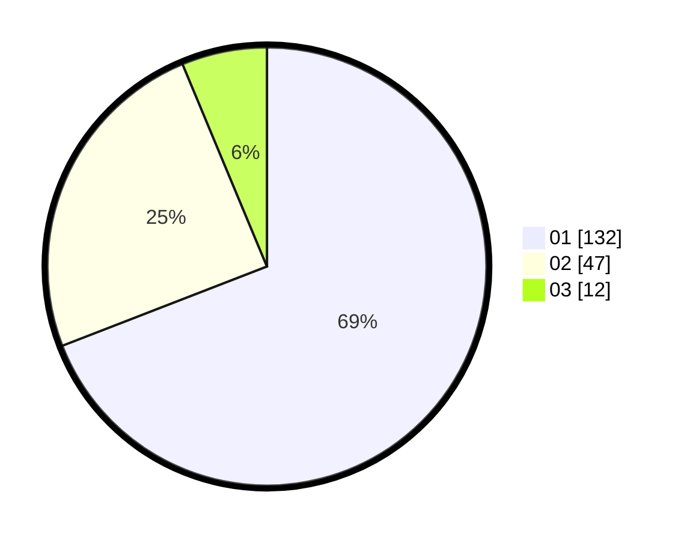

# Hasil

Hasil perolehan suara paslon dapat dilihat pada file paslon-01.txt, paslon-02.txt, dan paslon-03.txt.

Jika tidak ada, artinya data tersebut belum ada pada SIREKAP.

## Perolehan Suara

 * Paslon 01: **132**.
 * Paslon 02: **47**.
 * Paslon 03: **12**.

## Foto C Plano

https://sirekap-obj-formc.kpu.go.id/4cef/pemilu/ppwp/31/71/07/10/06/3171071006033-20240214-222520--05c07914-5996-4231-ba77-b118069aada8.jpg

https://sirekap-obj-formc.kpu.go.id/4cef/pemilu/ppwp/31/71/07/10/06/3171071006033-20240214-222638--590cfa2c-f562-471f-ad21-bf297af36068.jpg

https://sirekap-obj-formc.kpu.go.id/4cef/pemilu/ppwp/31/71/07/10/06/3171071006033-20240214-213627--e8399ef4-b375-4bac-9a73-6a8566193d46.jpg
