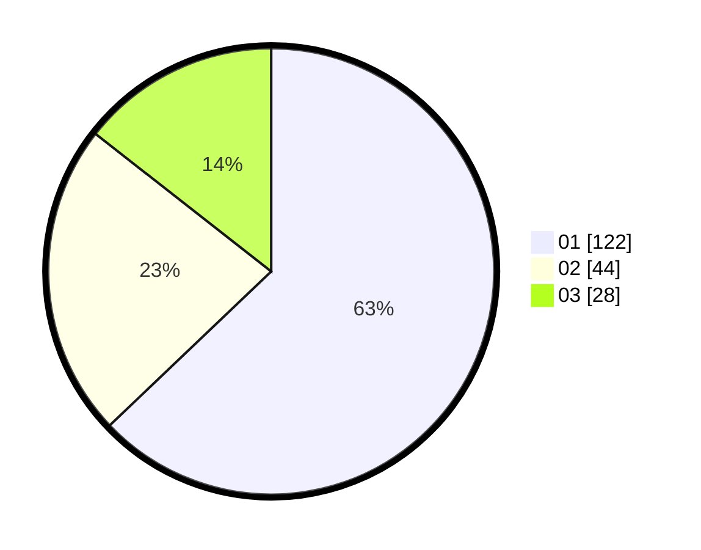

# Hasil

Hasil perolehan suara paslon dapat dilihat pada file paslon-01.txt, paslon-02.txt, dan paslon-03.txt.

Jika tidak ada, artinya data tersebut belum ada pada SIREKAP.

## Perolehan Suara

 * Paslon 01: **122**.
 * Paslon 02: **44**.
 * Paslon 03: **28**.

## Foto C Plano

https://sirekap-obj-formc.kpu.go.id/4622/pemilu/ppwp/31/71/07/10/06/3171071006034-20240215-105952--b8a8e289-0d96-40ec-b11e-de09dd8af286.jpg

https://sirekap-obj-formc.kpu.go.id/4622/pemilu/ppwp/31/71/07/10/06/3171071006034-20240215-110113--1976894e-6371-4961-9f19-aa049923f8c3.jpg

https://sirekap-obj-formc.kpu.go.id/4622/pemilu/ppwp/31/71/07/10/06/3171071006034-20240215-110240--5fee1475-38f1-4e59-912b-b717c05bd6f0.jpg

## DATA PEMILIH TETAP

Jumlah pemilih dalam DPT: **271**.
 * L: **144**.
 * P: **127**.

## DATA PENGGUNA HAK PILIH

Jumlah pengguna hak pilih dalam DPT: **186**.
 * L: **95**.
 * P: **91**.

Jumlah pengguna hak pilih dalam DPTb: **3**.
 * L: **0**.
 * P: **3**.

Jumlah pengguna hak pilih dalam DPK: **6**.
 * L: **2**.
 * P: **4**.

Jumlah pengguna hak pilih: **195**.
 * L: **97**.
 * P: **98**.

## JUMLAH SUARA SAH DAN TIDAK SAH

JUMLAH SELURUH SUARA SAH: **194**.

JUMLAH SUARA TIDAK SAH: **1**.

JUMLAH SELURUH SUARA SAH DAN SUARA TIDAK SAH: **195**.
