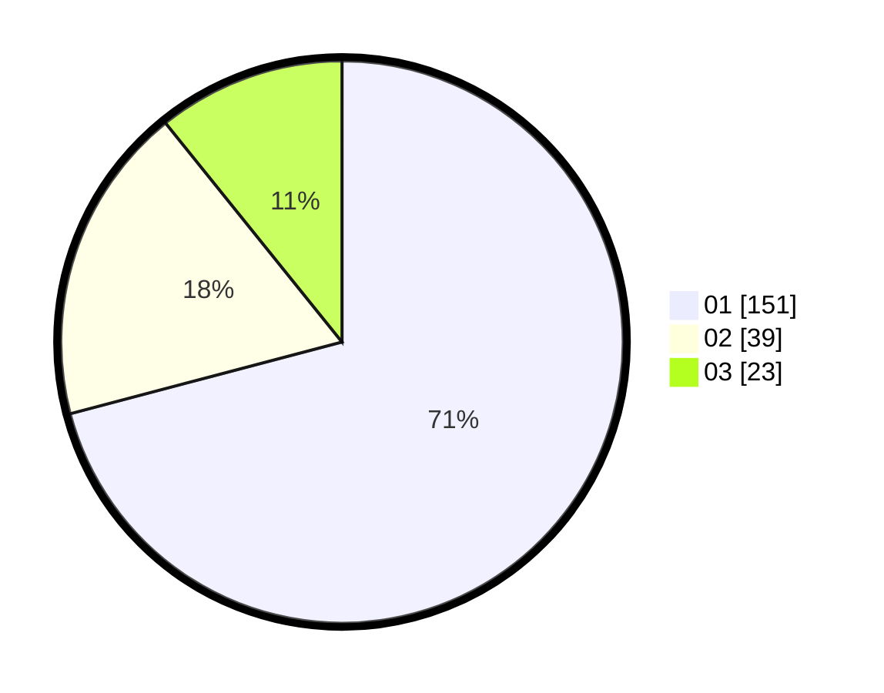

# Hasil

Hasil perolehan suara paslon dapat dilihat pada file paslon-01.txt, paslon-02.txt, dan paslon-03.txt.

Jika tidak ada, artinya data tersebut belum ada pada SIREKAP.

## Perolehan Suara

 * Paslon 01: **151**.
 * Paslon 02: **39**.
 * Paslon 03: **23**.

## Foto C Plano

https://sirekap-obj-formc.kpu.go.id/c4e3/pemilu/ppwp/31/71/07/10/06/3171071006035-20240216-163247--ba7c4878-afaf-4207-8c03-7efee90fad88.jpg

https://sirekap-obj-formc.kpu.go.id/c4e3/pemilu/ppwp/31/71/07/10/06/3171071006035-20240216-163248--db2448fd-58ea-4695-873b-0525774b5ecc.jpg

https://sirekap-obj-formc.kpu.go.id/c4e3/pemilu/ppwp/31/71/07/10/06/3171071006035-20240216-163247--fa621c59-910c-472a-acda-0f96d0d11861.jpg

## DATA PEMILIH TETAP

Jumlah pemilih dalam DPT: **271**.
 * L: **129**.
 * P: **142**.

## DATA PENGGUNA HAK PILIH

Jumlah pengguna hak pilih dalam DPT: **208**.
 * L: **97**.
 * P: **111**.

Jumlah pengguna hak pilih dalam DPTb: **1**.
 * L: **1**.
 * P: **0**.

Jumlah pengguna hak pilih dalam DPK: **4**.
 * L: **1**.
 * P: **3**.

Jumlah pengguna hak pilih: **213**.
 * L: **99**.
 * P: **114**.

## JUMLAH SUARA SAH DAN TIDAK SAH

JUMLAH SELURUH SUARA SAH: **213**.

JUMLAH SUARA TIDAK SAH: **0**.

JUMLAH SELURUH SUARA SAH DAN SUARA TIDAK SAH: **213**.
