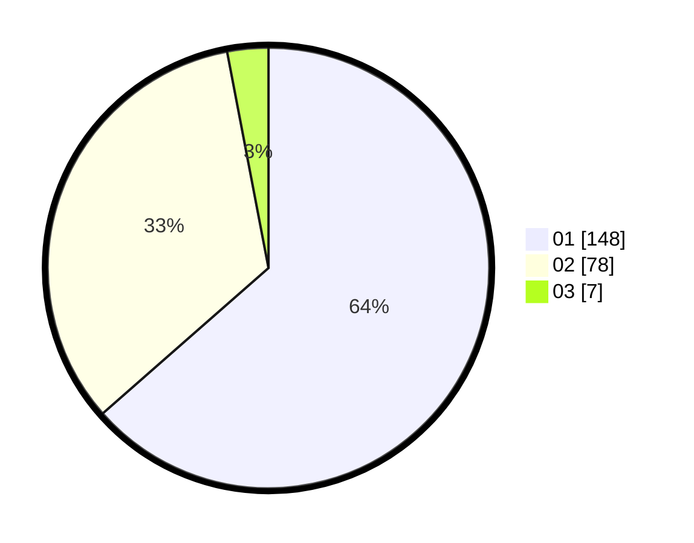

# Hasil

Hasil perolehan suara paslon dapat dilihat pada file paslon-01.txt, paslon-02.txt, dan paslon-03.txt.

Jika tidak ada, artinya data tersebut belum ada pada SIREKAP.

## Perolehan Suara

 * Paslon 01: **148**.
 * Paslon 02: **78**.
 * Paslon 03: **7**.

## Foto C Plano

https://sirekap-obj-formc.kpu.go.id/169d/pemilu/ppwp/31/71/07/10/06/3171071006040-20240216-094812--9095d152-e79d-47a1-9aac-f7e8a7d97f0d.jpg

https://sirekap-obj-formc.kpu.go.id/169d/pemilu/ppwp/31/71/07/10/06/3171071006040-20240216-094814--567edf6a-53ea-4300-b843-f6570c274d0c.jpg

https://sirekap-obj-formc.kpu.go.id/169d/pemilu/ppwp/31/71/07/10/06/3171071006040-20240216-094813--dbb649cb-80d1-411e-8029-bd102ac6328f.jpg

## DATA PEMILIH TETAP

Jumlah pemilih dalam DPT: **263**.
 * L: **132**.
 * P: **131**.

## DATA PENGGUNA HAK PILIH

Jumlah pengguna hak pilih dalam DPT: **223**.
 * L: **104**.
 * P: **119**.

Jumlah pengguna hak pilih dalam DPTb: **0**.
 * L: **0**.
 * P: **0**.

Jumlah pengguna hak pilih dalam DPK: **7**.
 * L: **5**.
 * P: **2**.

Jumlah pengguna hak pilih: **230**.
 * L: **109**.
 * P: **121**.

## JUMLAH SUARA SAH DAN TIDAK SAH

JUMLAH SELURUH SUARA SAH: **230**.

JUMLAH SUARA TIDAK SAH: **2**.

JUMLAH SELURUH SUARA SAH DAN SUARA TIDAK SAH: **232**.
