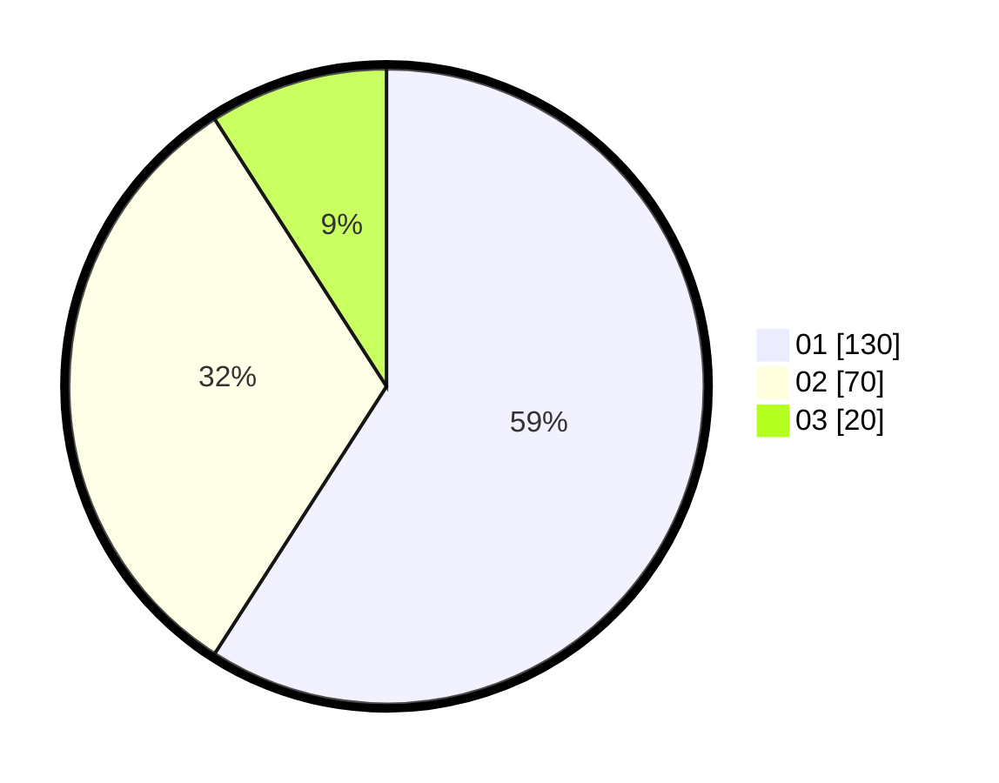

# Hasil

Hasil perolehan suara paslon dapat dilihat pada file paslon-01.txt, paslon-02.txt, dan paslon-03.txt.

Jika tidak ada, artinya data tersebut belum ada pada SIREKAP.

## Perolehan Suara

 * Paslon 01: **130**.
 * Paslon 02: **70**.
 * Paslon 03: **20**.

## Foto C Plano

https://sirekap-obj-formc.kpu.go.id/db9d/pemilu/ppwp/31/71/07/10/06/3171071006048-20240214-175326--3a820777-58d5-44a3-a311-2d89978b67d2.jpg

https://sirekap-obj-formc.kpu.go.id/db9d/pemilu/ppwp/31/71/07/10/06/3171071006048-20240214-184927--266f907d-f4d2-40fc-8b7c-11e01032a6d0.jpg

https://sirekap-obj-formc.kpu.go.id/db9d/pemilu/ppwp/31/71/07/10/06/3171071006048-20240214-184935--7009ba22-d4ed-44c9-9f6f-975da699e2b6.jpg

## DATA PEMILIH TETAP

Jumlah pemilih dalam DPT: **221**.
 * L: **110**.
 * P: **111**.

## DATA PENGGUNA HAK PILIH

Jumlah pengguna hak pilih dalam DPT: **215**.
 * L: **107**.
 * P: **108**.

Jumlah pengguna hak pilih dalam DPTb: **4**.
 * L: **3**.
 * P: **1**.

Jumlah pengguna hak pilih dalam DPK: **2**.
 * L: **0**.
 * P: **2**.

Jumlah pengguna hak pilih: **221**.
 * L: **110**.
 * P: **111**.

## JUMLAH SUARA SAH DAN TIDAK SAH

JUMLAH SELURUH SUARA SAH: **220**.

JUMLAH SUARA TIDAK SAH: **1**.

JUMLAH SELURUH SUARA SAH DAN SUARA TIDAK SAH: **221**.
