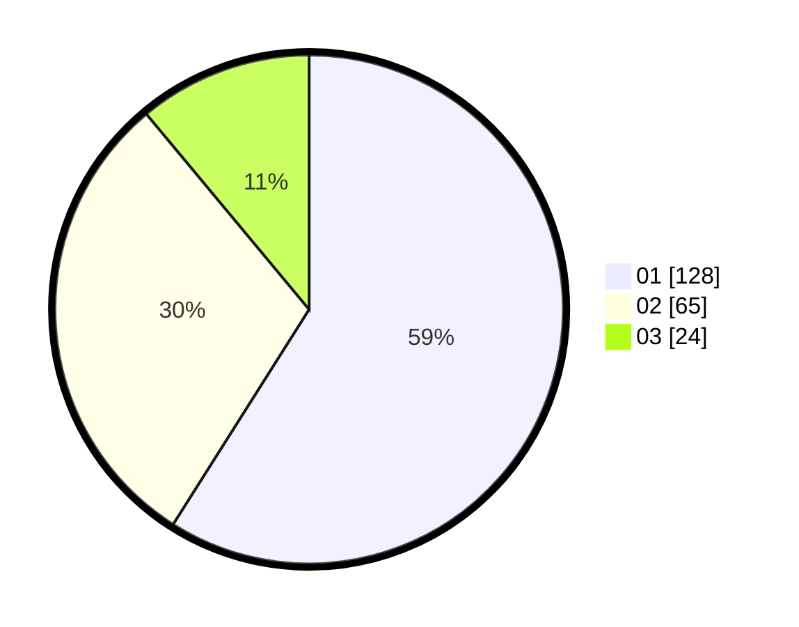

# Hasil

Hasil perolehan suara paslon dapat dilihat pada file paslon-01.txt, paslon-02.txt, dan paslon-03.txt.

Jika tidak ada, artinya data tersebut belum ada pada SIREKAP.

## Perolehan Suara

 * Paslon 01: **128**.
 * Paslon 02: **65**.
 * Paslon 03: **24**.

## Foto C Plano

https://sirekap-obj-formc.kpu.go.id/0284/pemilu/ppwp/31/71/07/10/06/3171071006050-20240216-170749--7ccb807b-e80e-4d90-807d-3da8e9ba2fea.jpg

https://sirekap-obj-formc.kpu.go.id/0284/pemilu/ppwp/31/71/07/10/06/3171071006050-20240216-170751--b97fe32e-412e-40b9-baee-56b208f140a6.jpg

https://sirekap-obj-formc.kpu.go.id/0284/pemilu/ppwp/31/71/07/10/06/3171071006050-20240216-170750--d795bb25-ffe9-4fe0-acd3-65b3d2543d05.jpg

## DATA PEMILIH TETAP

Jumlah pemilih dalam DPT: **275**.
 * L: **133**.
 * P: **142**.

## DATA PENGGUNA HAK PILIH

Jumlah pengguna hak pilih dalam DPT: **209**.
 * L: **98**.
 * P: **111**.

Jumlah pengguna hak pilih dalam DPTb: **7**.
 * L: **3**.
 * P: **4**.

Jumlah pengguna hak pilih dalam DPK: **2**.
 * L: **1**.
 * P: **1**.

Jumlah pengguna hak pilih: **218**.
 * L: **102**.
 * P: **116**.

## JUMLAH SUARA SAH DAN TIDAK SAH

JUMLAH SELURUH SUARA SAH: **217**.

JUMLAH SUARA TIDAK SAH: **1**.

JUMLAH SELURUH SUARA SAH DAN SUARA TIDAK SAH: **218**.
