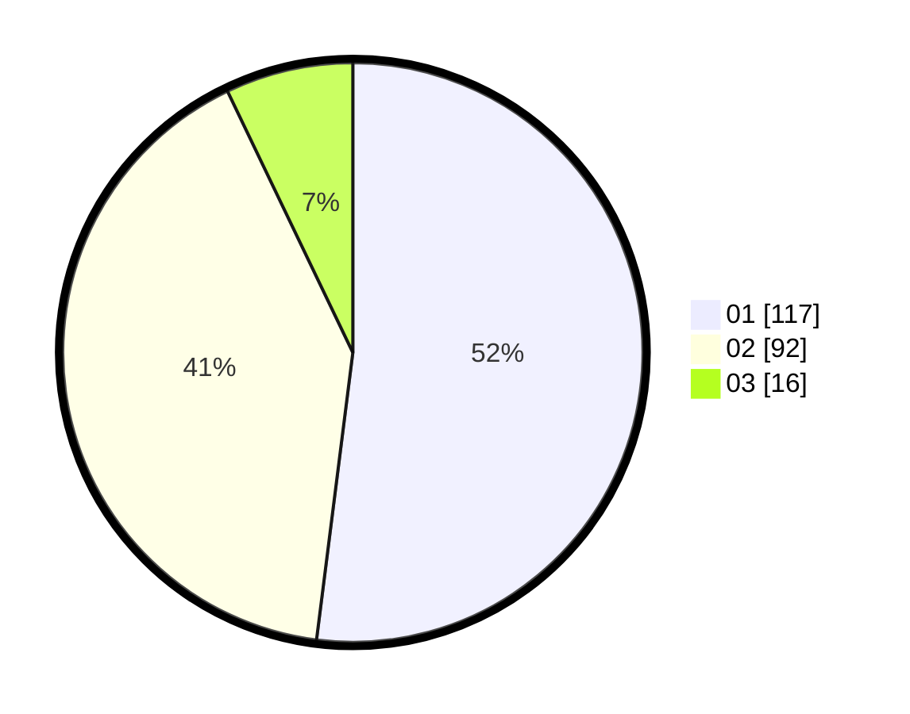

# Hasil

Hasil perolehan suara paslon dapat dilihat pada file paslon-01.txt, paslon-02.txt, dan paslon-03.txt.

Jika tidak ada, artinya data tersebut belum ada pada SIREKAP.

## Perolehan Suara

 * Paslon 01: **117**.
 * Paslon 02: **92**.
 * Paslon 03: **16**.

## Foto C Plano

https://sirekap-obj-formc.kpu.go.id/a05d/pemilu/ppwp/31/71/07/10/06/3171071006052-20240216-224326--483a6c5c-d2e2-45c0-99fd-056143247a8c.jpg

https://sirekap-obj-formc.kpu.go.id/a05d/pemilu/ppwp/31/71/07/10/06/3171071006052-20240216-224328--0602de0f-72ab-4cad-9a4f-2de68b23044e.jpg

https://sirekap-obj-formc.kpu.go.id/a05d/pemilu/ppwp/31/71/07/10/06/3171071006052-20240216-224327--25c8777f-0180-4b02-ba69-3f0b3e46eb69.jpg

## DATA PEMILIH TETAP

Jumlah pemilih dalam DPT: **277**.
 * L: **142**.
 * P: **135**.

## DATA PENGGUNA HAK PILIH

Jumlah pengguna hak pilih dalam DPT: **218**.
 * L: **106**.
 * P: **112**.

Jumlah pengguna hak pilih dalam DPTb: **6**.
 * L: **0**.
 * P: **6**.

Jumlah pengguna hak pilih dalam DPK: **3**.
 * L: **2**.
 * P: **1**.

Jumlah pengguna hak pilih: **227**.
 * L: **106**.
 * P: **112**.

## JUMLAH SUARA SAH DAN TIDAK SAH

JUMLAH SELURUH SUARA SAH: **225**.

JUMLAH SUARA TIDAK SAH: **2**.

JUMLAH SELURUH SUARA SAH DAN SUARA TIDAK SAH: **227**.
