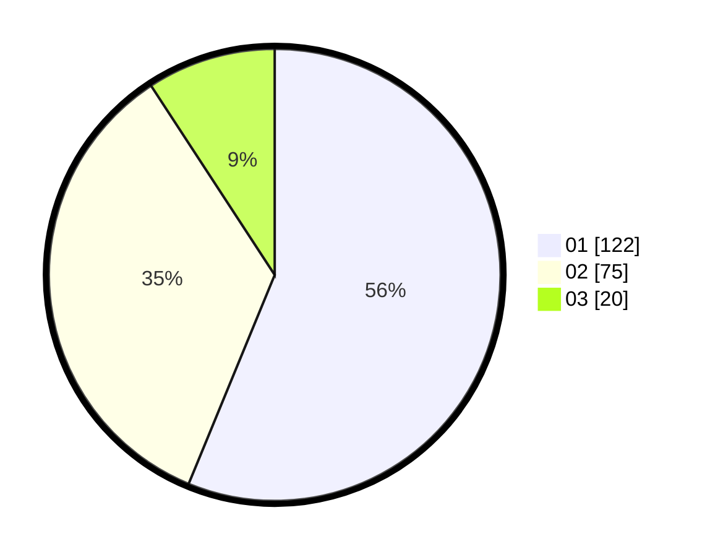

# Hasil

Hasil perolehan suara paslon dapat dilihat pada file paslon-01.txt, paslon-02.txt, dan paslon-03.txt.

Jika tidak ada, artinya data tersebut belum ada pada SIREKAP.

## Perolehan Suara

 * Paslon 01: **122**.
 * Paslon 02: **75**.
 * Paslon 03: **20**.

## Foto C Plano

https://sirekap-obj-formc.kpu.go.id/a247/pemilu/ppwp/31/71/07/10/06/3171071006058-20240216-174224--45ac95da-3a96-4dd7-9a27-4b4a8cde1d5f.jpg

https://sirekap-obj-formc.kpu.go.id/a247/pemilu/ppwp/31/71/07/10/06/3171071006058-20240216-174225--838de4a8-a95b-45e9-8c0c-c1a65f055b0d.jpg

https://sirekap-obj-formc.kpu.go.id/a247/pemilu/ppwp/31/71/07/10/06/3171071006058-20240216-174225--af36151c-c254-433a-a0f4-d5e28dfddaf4.jpg

## DATA PEMILIH TETAP

Jumlah pemilih dalam DPT: **267**.
 * L: **132**.
 * P: **135**.

## DATA PENGGUNA HAK PILIH

Jumlah pengguna hak pilih dalam DPT: **219**.
 * L: **111**.
 * P: **108**.

Jumlah pengguna hak pilih dalam DPTb: **3**.
 * L: **2**.
 * P: **1**.

Jumlah pengguna hak pilih dalam DPK: **0**.
 * L: **0**.
 * P: **0**.

Jumlah pengguna hak pilih: **222**.
 * L: **113**.
 * P: **109**.

## JUMLAH SUARA SAH DAN TIDAK SAH

JUMLAH SELURUH SUARA SAH: **217**.

JUMLAH SUARA TIDAK SAH: **5**.

JUMLAH SELURUH SUARA SAH DAN SUARA TIDAK SAH: **222**.
