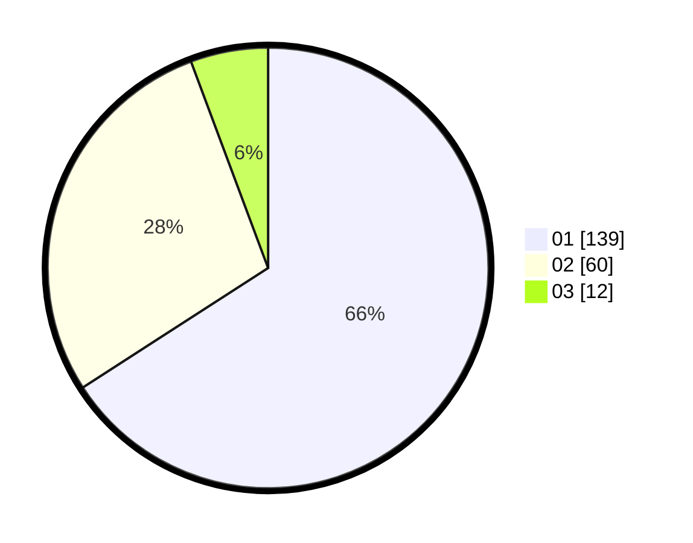

# Hasil

Hasil perolehan suara paslon dapat dilihat pada file paslon-01.txt, paslon-02.txt, dan paslon-03.txt.

Jika tidak ada, artinya data tersebut belum ada pada SIREKAP.

## Perolehan Suara

 * Paslon 01: **139**.
 * Paslon 02: **60**.
 * Paslon 03: **12**.

## Foto C Plano

https://sirekap-obj-formc.kpu.go.id/6df6/pemilu/ppwp/31/71/07/10/06/3171071006059-20240216-055655--aa0c8115-8a3c-4692-98ed-a77ec2d00b58.jpg

https://sirekap-obj-formc.kpu.go.id/6df6/pemilu/ppwp/31/71/07/10/06/3171071006059-20240216-055656--3cf7aecd-2f72-49b8-97bb-bef4762838e8.jpg

https://sirekap-obj-formc.kpu.go.id/6df6/pemilu/ppwp/31/71/07/10/06/3171071006059-20240216-055655--9238d625-b74d-4b23-bdcb-fedbeaa10a41.jpg

## DATA PEMILIH TETAP

Jumlah pemilih dalam DPT: **278**.
 * L: **140**.
 * P: **138**.

## DATA PENGGUNA HAK PILIH

Jumlah pengguna hak pilih dalam DPT: **208**.
 * L: **98**.
 * P: **110**.

Jumlah pengguna hak pilih dalam DPTb: **0**.
 * L: **0**.
 * P: **0**.

Jumlah pengguna hak pilih dalam DPK: **6**.
 * L: **4**.
 * P: **2**.

Jumlah pengguna hak pilih: **214**.
 * L: **102**.
 * P: **112**.

## JUMLAH SUARA SAH DAN TIDAK SAH

JUMLAH SELURUH SUARA SAH: **211**.

JUMLAH SUARA TIDAK SAH: **3**.

JUMLAH SELURUH SUARA SAH DAN SUARA TIDAK SAH: **214**.
