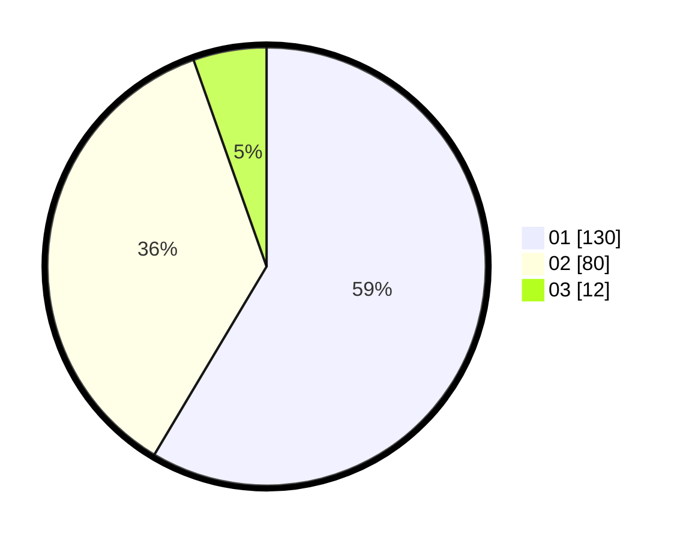

# Hasil

Hasil perolehan suara paslon dapat dilihat pada file paslon-01.txt, paslon-02.txt, dan paslon-03.txt.

Jika tidak ada, artinya data tersebut belum ada pada SIREKAP.

## Perolehan Suara

 * Paslon 01: **130**.
 * Paslon 02: **80**.
 * Paslon 03: **12**.

## Foto C Plano

https://sirekap-obj-formc.kpu.go.id/741b/pemilu/ppwp/31/71/07/10/06/3171071006061-20240216-140613--b2583d4a-2635-4199-8e51-3734f9271c3c.jpg

https://sirekap-obj-formc.kpu.go.id/741b/pemilu/ppwp/31/71/07/10/06/3171071006061-20240216-140614--8fba793e-c190-4ced-8add-40a5d5f63d2e.jpg

https://sirekap-obj-formc.kpu.go.id/741b/pemilu/ppwp/31/71/07/10/06/3171071006061-20240216-140613--786434f4-acc1-4cd0-9c29-374aa5cc65a0.jpg

## DATA PEMILIH TETAP

Jumlah pemilih dalam DPT: **281**.
 * L: **140**.
 * P: **141**.

## DATA PENGGUNA HAK PILIH

Jumlah pengguna hak pilih dalam DPT: **222**.
 * L: **107**.
 * P: **115**.

Jumlah pengguna hak pilih dalam DPTb: **1**.
 * L: **0**.
 * P: **1**.

Jumlah pengguna hak pilih dalam DPK: **3**.
 * L: **2**.
 * P: **1**.

Jumlah pengguna hak pilih: **226**.
 * L: **109**.
 * P: **117**.

## JUMLAH SUARA SAH DAN TIDAK SAH

JUMLAH SELURUH SUARA SAH: **222**.

JUMLAH SUARA TIDAK SAH: **4**.

JUMLAH SELURUH SUARA SAH DAN SUARA TIDAK SAH: **226**.
