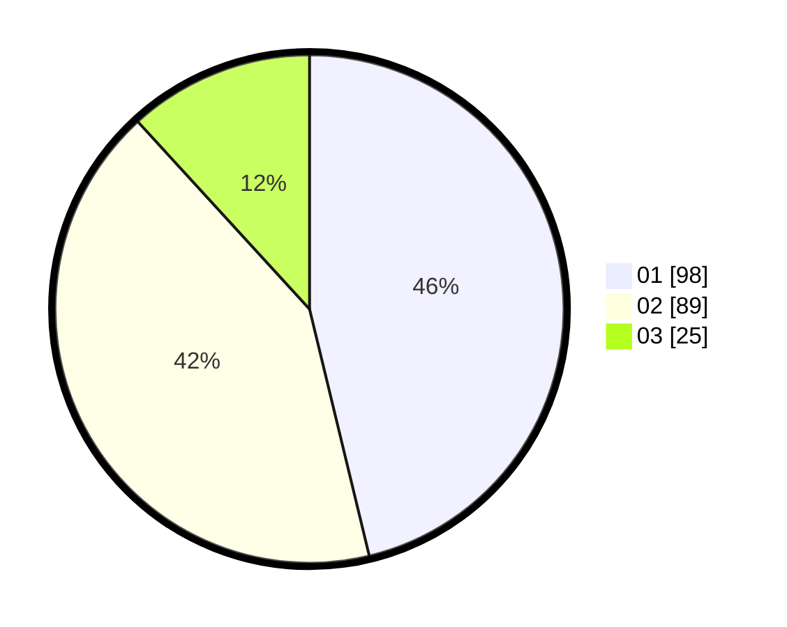

# Hasil

Hasil perolehan suara paslon dapat dilihat pada file paslon-01.txt, paslon-02.txt, dan paslon-03.txt.

Jika tidak ada, artinya data tersebut belum ada pada SIREKAP.

## Perolehan Suara

 * Paslon 01: **98**.
 * Paslon 02: **89**.
 * Paslon 03: **25**.

## Foto C Plano

https://sirekap-obj-formc.kpu.go.id/6cc3/pemilu/ppwp/31/71/07/10/06/3171071006062-20240216-162708--260fe22e-dbc3-4d18-aece-14334a64b86b.jpg

https://sirekap-obj-formc.kpu.go.id/6cc3/pemilu/ppwp/31/71/07/10/06/3171071006062-20240216-162709--ef6fa8af-e832-4804-8fd8-b1102f8c9f7c.jpg

https://sirekap-obj-formc.kpu.go.id/6cc3/pemilu/ppwp/31/71/07/10/06/3171071006062-20240214-184643--1bc51640-f85b-4ed9-91cd-3bd6fbaaa90a.jpg

## DATA PEMILIH TETAP

Jumlah pemilih dalam DPT: **260**.
 * L: **133**.
 * P: **127**.

## DATA PENGGUNA HAK PILIH

Jumlah pengguna hak pilih dalam DPT: **213**.
 * L: **104**.
 * P: **109**.

Jumlah pengguna hak pilih dalam DPTb: **0**.
 * L: **0**.
 * P: **0**.

Jumlah pengguna hak pilih dalam DPK: **5**.
 * L: **2**.
 * P: **3**.

Jumlah pengguna hak pilih: **218**.
 * L: **106**.
 * P: **112**.

## JUMLAH SUARA SAH DAN TIDAK SAH

JUMLAH SELURUH SUARA SAH: **212**.

JUMLAH SUARA TIDAK SAH: **6**.

JUMLAH SELURUH SUARA SAH DAN SUARA TIDAK SAH: **218**.
