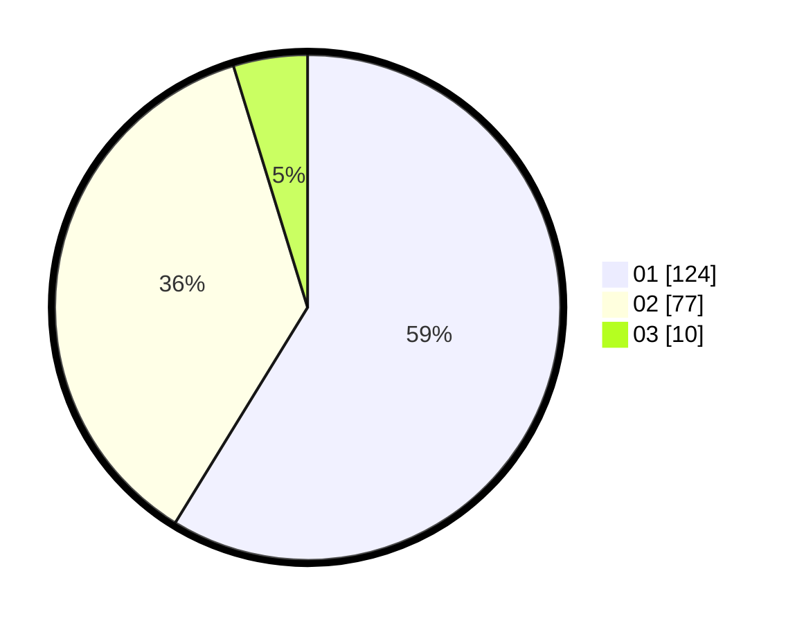

# Hasil

Hasil perolehan suara paslon dapat dilihat pada file paslon-01.txt, paslon-02.txt, dan paslon-03.txt.

Jika tidak ada, artinya data tersebut belum ada pada SIREKAP.

## Perolehan Suara

 * Paslon 01: **124**.
 * Paslon 02: **77**.
 * Paslon 03: **10**.

## Foto C Plano

https://sirekap-obj-formc.kpu.go.id/e094/pemilu/ppwp/31/71/07/10/06/3171071006063-20240215-050636--e7cc0edc-453d-4e72-b9eb-2167e4caac8e.jpg

https://sirekap-obj-formc.kpu.go.id/e094/pemilu/ppwp/31/71/07/10/06/3171071006063-20240215-050657--14dd3c7f-c7be-447c-80c8-51d396d82ca4.jpg

https://sirekap-obj-formc.kpu.go.id/e094/pemilu/ppwp/31/71/07/10/06/3171071006063-20240215-050646--0643a737-3ffc-47df-b0a3-aee8acd33e99.jpg

## DATA PEMILIH TETAP

Jumlah pemilih dalam DPT: **269**.
 * L: **142**.
 * P: **127**.

## DATA PENGGUNA HAK PILIH

Jumlah pengguna hak pilih dalam DPT: **213**.
 * L: **108**.
 * P: **105**.

Jumlah pengguna hak pilih dalam DPTb: **0**.
 * L: **0**.
 * P: **0**.

Jumlah pengguna hak pilih dalam DPK: **1**.
 * L: **1**.
 * P: **0**.

Jumlah pengguna hak pilih: **214**.
 * L: **109**.
 * P: **105**.

## JUMLAH SUARA SAH DAN TIDAK SAH

JUMLAH SELURUH SUARA SAH: **211**.

JUMLAH SUARA TIDAK SAH: **3**.

JUMLAH SELURUH SUARA SAH DAN SUARA TIDAK SAH: **214**.
