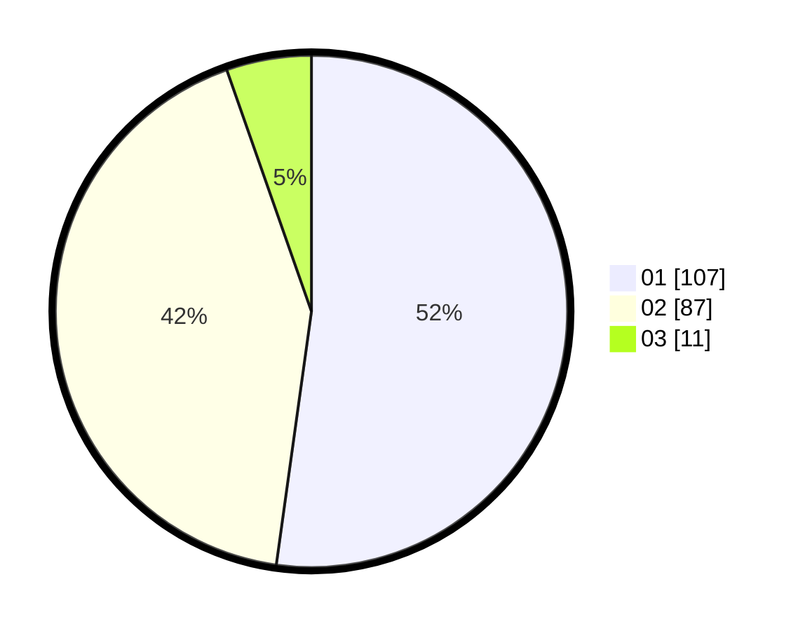

# Hasil

Hasil perolehan suara paslon dapat dilihat pada file paslon-01.txt, paslon-02.txt, dan paslon-03.txt.

Jika tidak ada, artinya data tersebut belum ada pada SIREKAP.

## Perolehan Suara

 * Paslon 01: **107**.
 * Paslon 02: **87**.
 * Paslon 03: **11**.

## Foto C Plano

https://sirekap-obj-formc.kpu.go.id/cbb0/pemilu/ppwp/31/71/07/10/06/3171071006065-20240216-151519--82de7ab9-6543-4449-9642-9731ec8f47f4.jpg

https://sirekap-obj-formc.kpu.go.id/cbb0/pemilu/ppwp/31/71/07/10/06/3171071006065-20240216-151520--2977fbb2-7b25-447f-911d-e56a6abb5c3f.jpg

https://sirekap-obj-formc.kpu.go.id/cbb0/pemilu/ppwp/31/71/07/10/06/3171071006065-20240216-151519--58cd6f89-45c9-47ee-a0f6-5998eb72f3b2.jpg

## DATA PEMILIH TETAP

Jumlah pemilih dalam DPT: **201**.
 * L: **106**.
 * P: **95**.

## DATA PENGGUNA HAK PILIH

Jumlah pengguna hak pilih dalam DPT: **201**.
 * L: **106**.
 * P: **95**.

Jumlah pengguna hak pilih dalam DPTb: **3**.
 * L: **1**.
 * P: **2**.

Jumlah pengguna hak pilih dalam DPK: **3**.
 * L: **1**.
 * P: **2**.

Jumlah pengguna hak pilih: **207**.
 * L: **108**.
 * P: **99**.

## JUMLAH SUARA SAH DAN TIDAK SAH

JUMLAH SELURUH SUARA SAH: **205**.

JUMLAH SUARA TIDAK SAH: **2**.

JUMLAH SELURUH SUARA SAH DAN SUARA TIDAK SAH: **207**.
