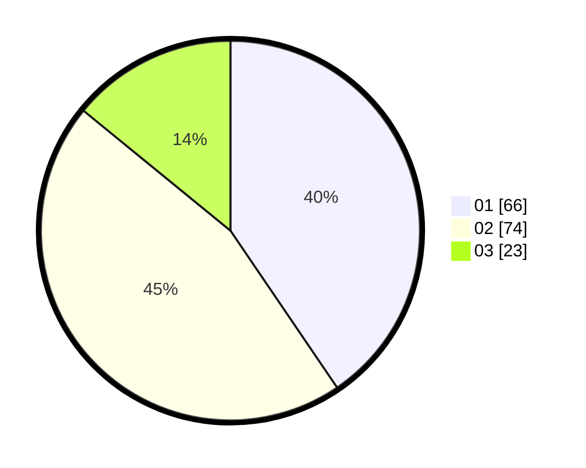

# Hasil

Hasil perolehan suara paslon dapat dilihat pada file paslon-01.txt, paslon-02.txt, dan paslon-03.txt.

Jika tidak ada, artinya data tersebut belum ada pada SIREKAP.

## Perolehan Suara

 * Paslon 01: **66**.
 * Paslon 02: **74**.
 * Paslon 03: **23**.

## Foto C Plano

https://sirekap-obj-formc.kpu.go.id/b6a1/pemilu/ppwp/31/71/07/10/06/3171071006066-20240214-180243--bb2ef8a8-7346-460e-9f3d-d346396c0fd3.jpg

https://sirekap-obj-formc.kpu.go.id/b6a1/pemilu/ppwp/31/71/07/10/06/3171071006066-20240214-184557--252b6ec8-3aba-4871-9536-8b9f5fe7b932.jpg

https://sirekap-obj-formc.kpu.go.id/b6a1/pemilu/ppwp/31/71/07/10/06/3171071006066-20240214-184601--dab36080-2cbd-4683-84d9-861431d2ff83.jpg

## DATA PEMILIH TETAP

Jumlah pemilih dalam DPT: **205**.
 * L: **109**.
 * P: **96**.

## DATA PENGGUNA HAK PILIH

Jumlah pengguna hak pilih dalam DPT: **165**.
 * L: **89**.
 * P: **76**.

Jumlah pengguna hak pilih dalam DPTb: **0**.
 * L: **0**.
 * P: **0**.

Jumlah pengguna hak pilih dalam DPK: **1**.
 * L: **1**.
 * P: **0**.

Jumlah pengguna hak pilih: **166**.
 * L: **90**.
 * P: **76**.

## JUMLAH SUARA SAH DAN TIDAK SAH

JUMLAH SELURUH SUARA SAH: **163**.

JUMLAH SUARA TIDAK SAH: **3**.

JUMLAH SELURUH SUARA SAH DAN SUARA TIDAK SAH: **166**.
