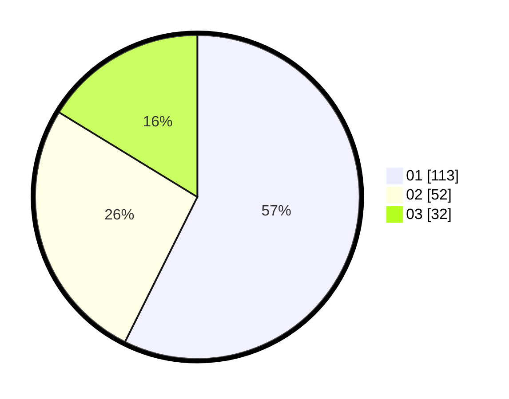

# Hasil

Hasil perolehan suara paslon dapat dilihat pada file paslon-01.txt, paslon-02.txt, dan paslon-03.txt.

Jika tidak ada, artinya data tersebut belum ada pada SIREKAP.

## Perolehan Suara

 * Paslon 01: **113**.
 * Paslon 02: **52**.
 * Paslon 03: **32**.

## Foto C Plano

https://sirekap-obj-formc.kpu.go.id/cd79/pemilu/ppwp/31/71/07/10/06/3171071006069-20240214-233352--7f29b651-c0f8-4c13-9eb8-6b16010b6b21.jpg

https://sirekap-obj-formc.kpu.go.id/cd79/pemilu/ppwp/31/71/07/10/06/3171071006069-20240214-233439--59f8bea0-7e4a-4251-ad7b-f76335d0c1cd.jpg

https://sirekap-obj-formc.kpu.go.id/cd79/pemilu/ppwp/31/71/07/10/06/3171071006069-20240214-233635--4ba975a7-8b7a-40dc-b425-9a06cd96fd16.jpg

## DATA PEMILIH TETAP

Jumlah pemilih dalam DPT: **292**.
 * L: **131**.
 * P: **161**.

## DATA PENGGUNA HAK PILIH

Jumlah pengguna hak pilih dalam DPT: **175**.
 * L: **72**.
 * P: **103**.

Jumlah pengguna hak pilih dalam DPTb: **16**.
 * L: **8**.
 * P: **8**.

Jumlah pengguna hak pilih dalam DPK: **9**.
 * L: **6**.
 * P: **3**.

Jumlah pengguna hak pilih: **200**.
 * L: **86**.
 * P: **114**.

## JUMLAH SUARA SAH DAN TIDAK SAH

JUMLAH SELURUH SUARA SAH: **197**.

JUMLAH SUARA TIDAK SAH: **3**.

JUMLAH SELURUH SUARA SAH DAN SUARA TIDAK SAH: **200**.
