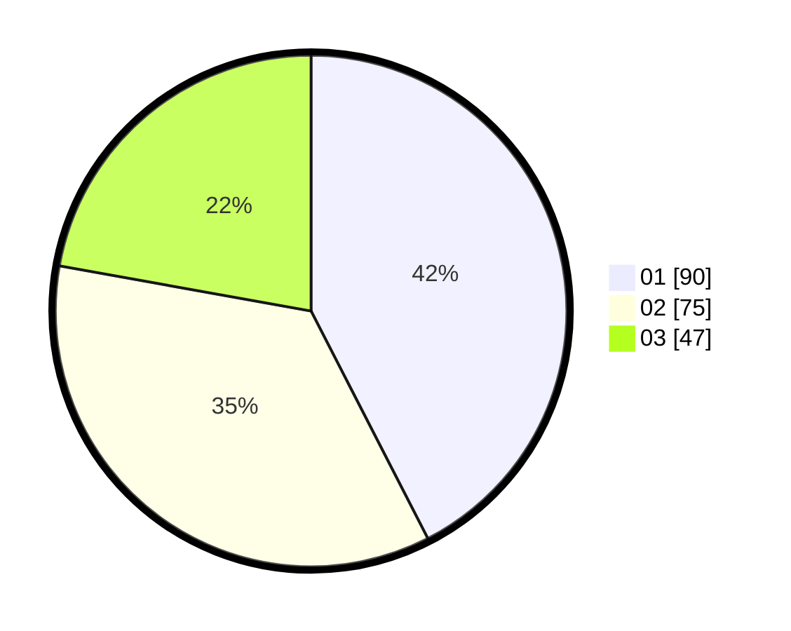

# Hasil

Hasil perolehan suara paslon dapat dilihat pada file paslon-01.txt, paslon-02.txt, dan paslon-03.txt.

Jika tidak ada, artinya data tersebut belum ada pada SIREKAP.

## Perolehan Suara

 * Paslon 01: **90**.
 * Paslon 02: **75**.
 * Paslon 03: **47**.

## Foto C Plano

https://sirekap-obj-formc.kpu.go.id/5b22/pemilu/ppwp/31/71/07/10/06/3171071006072-20240216-144253--4d903610-20d3-44f2-8db8-1cd251f17c4b.jpg

https://sirekap-obj-formc.kpu.go.id/5b22/pemilu/ppwp/31/71/07/10/06/3171071006072-20240216-144254--19098e19-56c2-4e66-9d3e-617c4bb54cab.jpg

https://sirekap-obj-formc.kpu.go.id/5b22/pemilu/ppwp/31/71/07/10/06/3171071006072-20240216-144254--a3d00a8f-ace0-464b-9bfa-07be13534fb7.jpg

## DATA PEMILIH TETAP

Jumlah pemilih dalam DPT: **284**.
 * L: **135**.
 * P: **149**.

## DATA PENGGUNA HAK PILIH

Jumlah pengguna hak pilih dalam DPT: **208**.
 * L: **93**.
 * P: **115**.

Jumlah pengguna hak pilih dalam DPTb: **7**.
 * L: **3**.
 * P: **4**.

Jumlah pengguna hak pilih dalam DPK: **0**.
 * L: **0**.
 * P: **0**.

Jumlah pengguna hak pilih: **215**.
 * L: **96**.
 * P: **119**.

## JUMLAH SUARA SAH DAN TIDAK SAH

JUMLAH SELURUH SUARA SAH: **212**.

JUMLAH SUARA TIDAK SAH: **3**.

JUMLAH SELURUH SUARA SAH DAN SUARA TIDAK SAH: **215**.
