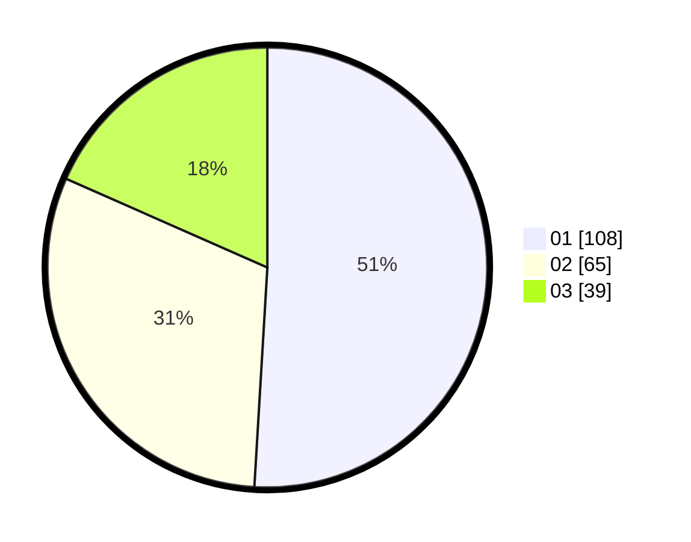

# Hasil

Hasil perolehan suara paslon dapat dilihat pada file paslon-01.txt, paslon-02.txt, dan paslon-03.txt.

Jika tidak ada, artinya data tersebut belum ada pada SIREKAP.

## Perolehan Suara

 * Paslon 01: **108**.
 * Paslon 02: **65**.
 * Paslon 03: **39**.

## Foto C Plano

https://sirekap-obj-formc.kpu.go.id/862a/pemilu/ppwp/31/71/07/10/06/3171071006073-20240215-221710--40410bea-ff86-41b7-8fe1-834c2cc41bae.jpg

https://sirekap-obj-formc.kpu.go.id/862a/pemilu/ppwp/31/71/07/10/06/3171071006073-20240215-221712--f30293d1-2836-43c6-90c4-233dc284de7f.jpg

https://sirekap-obj-formc.kpu.go.id/862a/pemilu/ppwp/31/71/07/10/06/3171071006073-20240215-221711--ffb2d047-a775-4e42-9625-3289ae18427f.jpg

## DATA PEMILIH TETAP

Jumlah pemilih dalam DPT: **278**.
 * L: **136**.
 * P: **142**.

## DATA PENGGUNA HAK PILIH

Jumlah pengguna hak pilih dalam DPT: **201**.
 * L: **101**.
 * P: **100**.

Jumlah pengguna hak pilih dalam DPTb: **6**.
 * L: **3**.
 * P: **3**.

Jumlah pengguna hak pilih dalam DPK: **5**.
 * L: **2**.
 * P: **3**.

Jumlah pengguna hak pilih: **212**.
 * L: **106**.
 * P: **106**.

## JUMLAH SUARA SAH DAN TIDAK SAH

JUMLAH SELURUH SUARA SAH: **212**.

JUMLAH SUARA TIDAK SAH: **0**.

JUMLAH SELURUH SUARA SAH DAN SUARA TIDAK SAH: **212**.
