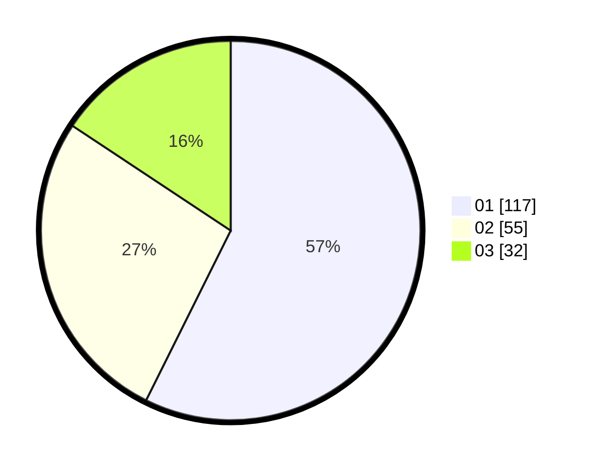

# Hasil

Hasil perolehan suara paslon dapat dilihat pada file paslon-01.txt, paslon-02.txt, dan paslon-03.txt.

Jika tidak ada, artinya data tersebut belum ada pada SIREKAP.

## Perolehan Suara

 * Paslon 01: **117**.
 * Paslon 02: **55**.
 * Paslon 03: **32**.

## Foto C Plano

https://sirekap-obj-formc.kpu.go.id/a1ef/pemilu/ppwp/31/71/07/10/06/3171071006074-20240216-164730--1693a3f4-0e80-4684-b041-f58d2517914f.jpg

https://sirekap-obj-formc.kpu.go.id/a1ef/pemilu/ppwp/31/71/07/10/06/3171071006074-20240216-164732--809bacc9-4410-4039-834e-8db6f9babb6e.jpg

https://sirekap-obj-formc.kpu.go.id/a1ef/pemilu/ppwp/31/71/07/10/06/3171071006074-20240216-164731--bedf1481-887a-46b5-b3da-a16e8f5830f0.jpg

## DATA PEMILIH TETAP

Jumlah pemilih dalam DPT: **275**.
 * L: **141**.
 * P: **134**.

## DATA PENGGUNA HAK PILIH

Jumlah pengguna hak pilih dalam DPT: **182**.
 * L: **90**.
 * P: **92**.

Jumlah pengguna hak pilih dalam DPTb: **11**.
 * L: **7**.
 * P: **4**.

Jumlah pengguna hak pilih dalam DPK: **11**.
 * L: **5**.
 * P: **6**.

Jumlah pengguna hak pilih: **204**.
 * L: **102**.
 * P: **102**.

## JUMLAH SUARA SAH DAN TIDAK SAH

JUMLAH SELURUH SUARA SAH: **204**.

JUMLAH SUARA TIDAK SAH: **2**.

JUMLAH SELURUH SUARA SAH DAN SUARA TIDAK SAH: **206**.
