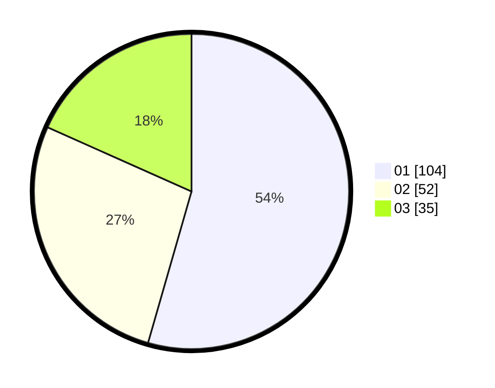

# Hasil

Hasil perolehan suara paslon dapat dilihat pada file paslon-01.txt, paslon-02.txt, dan paslon-03.txt.

Jika tidak ada, artinya data tersebut belum ada pada SIREKAP.

## Perolehan Suara

 * Paslon 01: **104**.
 * Paslon 02: **52**.
 * Paslon 03: **35**.

## Foto C Plano

https://sirekap-obj-formc.kpu.go.id/5908/pemilu/ppwp/31/71/07/10/06/3171071006076-20240214-155531--a6aaa097-e09c-4f71-b6dc-92932c5800e3.jpg

https://sirekap-obj-formc.kpu.go.id/5908/pemilu/ppwp/31/71/07/10/06/3171071006076-20240214-155601--9318aa85-31a0-4f79-8155-5995c862d0ae.jpg

https://sirekap-obj-formc.kpu.go.id/5908/pemilu/ppwp/31/71/07/10/06/3171071006076-20240214-155654--7113b67e-f6f9-4e66-974d-920ede072a3c.jpg

## DATA PEMILIH TETAP

Jumlah pemilih dalam DPT: **274**.
 * L: **135**.
 * P: **139**.

## DATA PENGGUNA HAK PILIH

Jumlah pengguna hak pilih dalam DPT: **176**.
 * L: **86**.
 * P: **90**.

Jumlah pengguna hak pilih dalam DPTb: **8**.
 * L: **4**.
 * P: **4**.

Jumlah pengguna hak pilih dalam DPK: **7**.
 * L: **3**.
 * P: **4**.

Jumlah pengguna hak pilih: **191**.
 * L: **93**.
 * P: **98**.

## JUMLAH SUARA SAH DAN TIDAK SAH

JUMLAH SELURUH SUARA SAH: **191**.

JUMLAH SUARA TIDAK SAH: **0**.

JUMLAH SELURUH SUARA SAH DAN SUARA TIDAK SAH: **191**.
