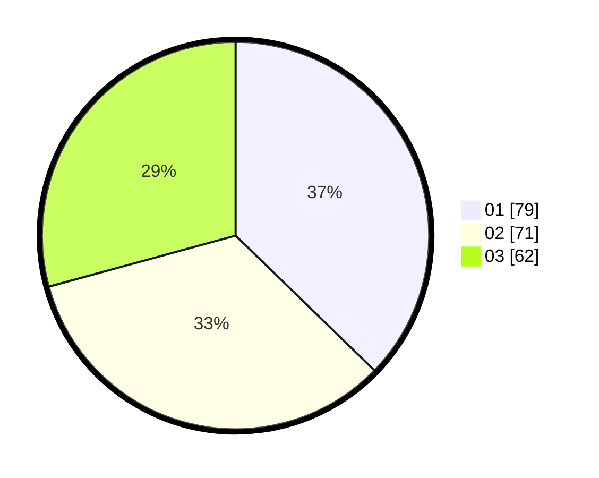

# Hasil

Hasil perolehan suara paslon dapat dilihat pada file paslon-01.txt, paslon-02.txt, dan paslon-03.txt.

Jika tidak ada, artinya data tersebut belum ada pada SIREKAP.

## Perolehan Suara

 * Paslon 01: **79**.
 * Paslon 02: **71**.
 * Paslon 03: **62**.

## Foto C Plano

https://sirekap-obj-formc.kpu.go.id/2580/pemilu/ppwp/31/71/07/10/07/3171071007001-20240214-231444--1f8afb61-12a8-44e7-836f-1779da1fc035.jpg

https://sirekap-obj-formc.kpu.go.id/2580/pemilu/ppwp/31/71/07/10/07/3171071007001-20240214-231617--8575a56e-1b19-4d4b-9df1-6eddd33ecbba.jpg

https://sirekap-obj-formc.kpu.go.id/2580/pemilu/ppwp/31/71/07/10/07/3171071007001-20240214-231717--94ffb1d1-f9bf-4ffb-8e45-913dd7dbb407.jpg

## DATA PEMILIH TETAP

Jumlah pemilih dalam DPT: **277**.
 * L: **143**.
 * P: **134**.

## DATA PENGGUNA HAK PILIH

Jumlah pengguna hak pilih dalam DPT: **205**.
 * L: **98**.
 * P: **107**.

Jumlah pengguna hak pilih dalam DPTb: **9**.
 * L: **4**.
 * P: **5**.

Jumlah pengguna hak pilih dalam DPK: **2**.
 * L: **1**.
 * P: **1**.

Jumlah pengguna hak pilih: **216**.
 * L: **103**.
 * P: **113**.

## JUMLAH SUARA SAH DAN TIDAK SAH

JUMLAH SELURUH SUARA SAH: **212**.

JUMLAH SUARA TIDAK SAH: **4**.

JUMLAH SELURUH SUARA SAH DAN SUARA TIDAK SAH: **216**.
