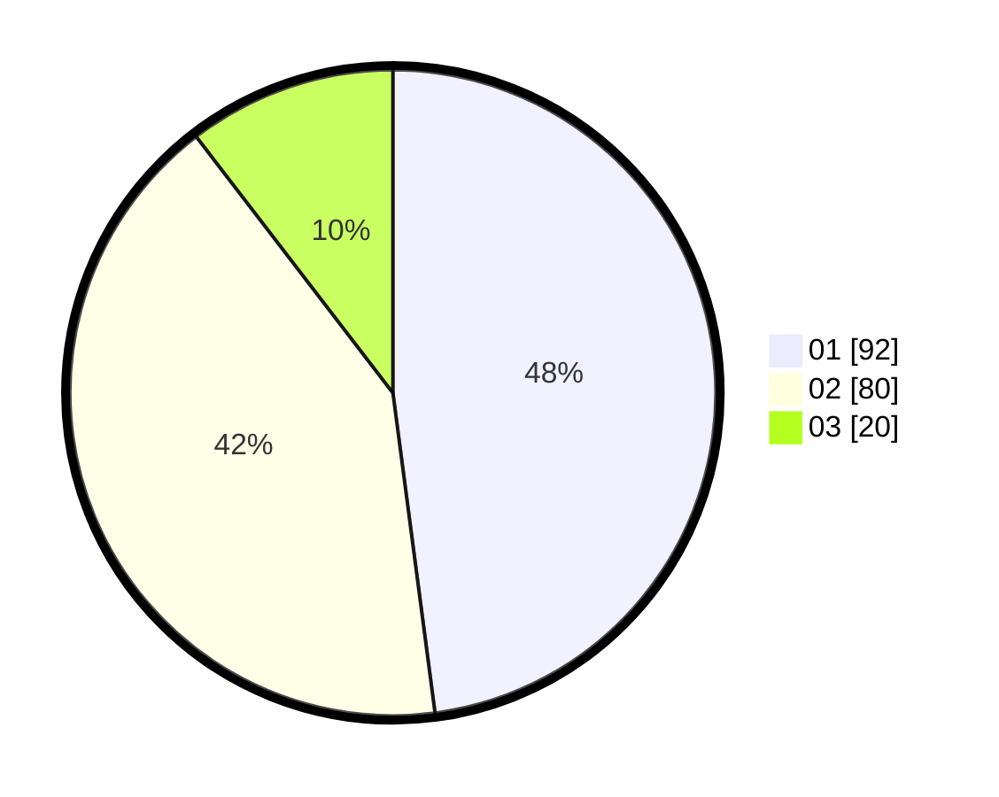

# Hasil

Hasil perolehan suara paslon dapat dilihat pada file paslon-01.txt, paslon-02.txt, dan paslon-03.txt.

Jika tidak ada, artinya data tersebut belum ada pada SIREKAP.

## Perolehan Suara

 * Paslon 01: **92**.
 * Paslon 02: **80**.
 * Paslon 03: **20**.

## Foto C Plano

https://sirekap-obj-formc.kpu.go.id/1561/pemilu/ppwp/31/71/07/10/07/3171071007003-20240215-024055--dcf69145-d7f1-470e-8eff-5ea75842460a.jpg

https://sirekap-obj-formc.kpu.go.id/1561/pemilu/ppwp/31/71/07/10/07/3171071007003-20240215-024136--43505430-4fb5-4020-a7c4-21c6e568c98a.jpg

https://sirekap-obj-formc.kpu.go.id/1561/pemilu/ppwp/31/71/07/10/07/3171071007003-20240215-024224--2a201e26-12a2-49cf-86b9-e750567c8781.jpg

## DATA PEMILIH TETAP

Jumlah pemilih dalam DPT: **283**.
 * L: **151**.
 * P: **132**.

## DATA PENGGUNA HAK PILIH

Jumlah pengguna hak pilih dalam DPT: **191**.
 * L: **105**.
 * P: **86**.

Jumlah pengguna hak pilih dalam DPTb: **0**.
 * L: **0**.
 * P: **0**.

Jumlah pengguna hak pilih dalam DPK: **2**.
 * L: **1**.
 * P: **1**.

Jumlah pengguna hak pilih: **193**.
 * L: **106**.
 * P: **87**.

## JUMLAH SUARA SAH DAN TIDAK SAH

JUMLAH SELURUH SUARA SAH: **192**.

JUMLAH SUARA TIDAK SAH: **1**.

JUMLAH SELURUH SUARA SAH DAN SUARA TIDAK SAH: **193**.
