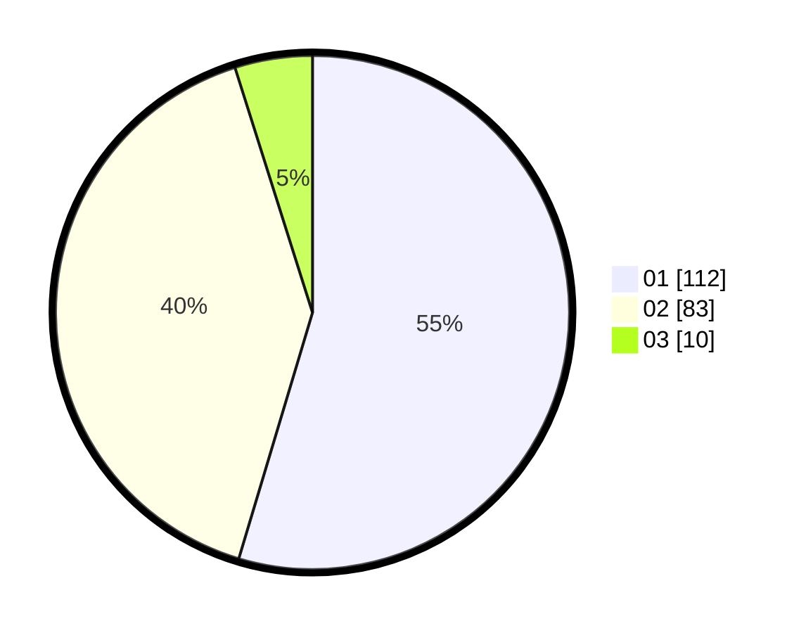

# Hasil

Hasil perolehan suara paslon dapat dilihat pada file paslon-01.txt, paslon-02.txt, dan paslon-03.txt.

Jika tidak ada, artinya data tersebut belum ada pada SIREKAP.

## Perolehan Suara

 * Paslon 01: **112**.
 * Paslon 02: **83**.
 * Paslon 03: **10**.

## Foto C Plano

https://sirekap-obj-formc.kpu.go.id/c854/pemilu/ppwp/31/71/07/10/07/3171071007006-20240214-203804--0fb817a4-e687-40f9-b17f-7fcc7cf93a79.jpg

https://sirekap-obj-formc.kpu.go.id/c854/pemilu/ppwp/31/71/07/10/07/3171071007006-20240214-205359--b5d1a9ab-7770-4821-924a-023a2e204293.jpg

https://sirekap-obj-formc.kpu.go.id/c854/pemilu/ppwp/31/71/07/10/07/3171071007006-20240214-205419--12423294-ef43-4f5e-bb25-a76bed415d53.jpg

## DATA PEMILIH TETAP

Jumlah pemilih dalam DPT: **253**.
 * L: **117**.
 * P: **136**.

## DATA PENGGUNA HAK PILIH

Jumlah pengguna hak pilih dalam DPT: **203**.
 * L: **90**.
 * P: **113**.

Jumlah pengguna hak pilih dalam DPTb: **2**.
 * L: **0**.
 * P: **2**.

Jumlah pengguna hak pilih dalam DPK: **5**.
 * L: **3**.
 * P: **2**.

Jumlah pengguna hak pilih: **210**.
 * L: **93**.
 * P: **117**.

## JUMLAH SUARA SAH DAN TIDAK SAH

JUMLAH SELURUH SUARA SAH: **205**.

JUMLAH SUARA TIDAK SAH: **5**.

JUMLAH SELURUH SUARA SAH DAN SUARA TIDAK SAH: **210**.
