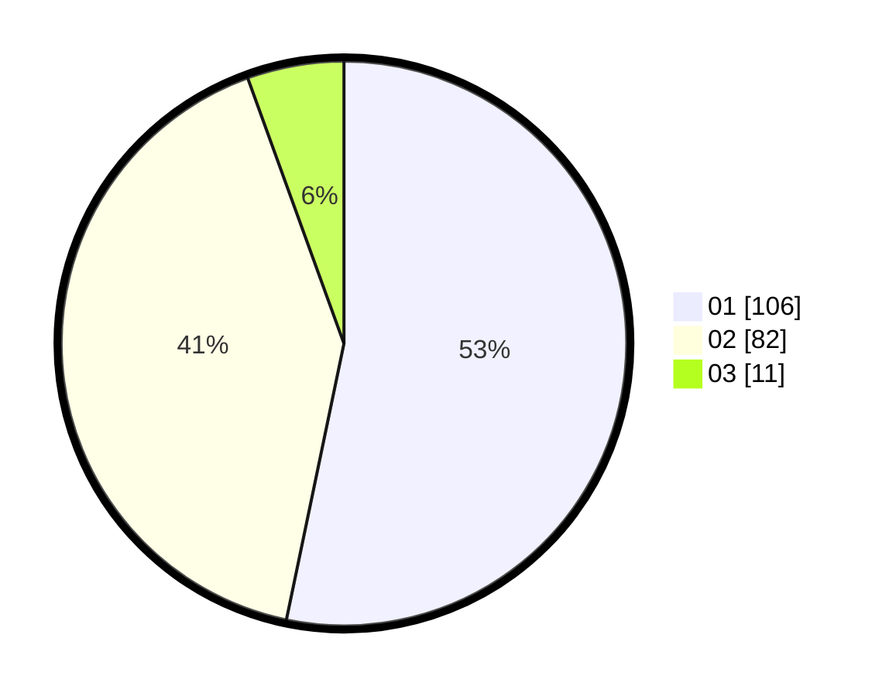

# Hasil

Hasil perolehan suara paslon dapat dilihat pada file paslon-01.txt, paslon-02.txt, dan paslon-03.txt.

Jika tidak ada, artinya data tersebut belum ada pada SIREKAP.

## Perolehan Suara

 * Paslon 01: **106**.
 * Paslon 02: **82**.
 * Paslon 03: **11**.

## Foto C Plano

https://sirekap-obj-formc.kpu.go.id/f0f8/pemilu/ppwp/31/71/07/10/07/3171071007008-20240214-212416--2f02d9d1-9884-4c1a-87cc-111423249820.jpg

https://sirekap-obj-formc.kpu.go.id/f0f8/pemilu/ppwp/31/71/07/10/07/3171071007008-20240214-212456--83b0680e-f6a6-444b-8cec-37587ff30e67.jpg

https://sirekap-obj-formc.kpu.go.id/f0f8/pemilu/ppwp/31/71/07/10/07/3171071007008-20240214-212531--cb73d67c-20f0-4979-8cb2-df6d7da6c0b0.jpg

## DATA PEMILIH TETAP

Jumlah pemilih dalam DPT: **238**.
 * L: **122**.
 * P: **116**.

## DATA PENGGUNA HAK PILIH

Jumlah pengguna hak pilih dalam DPT: **197**.
 * L: **100**.
 * P: **97**.

Jumlah pengguna hak pilih dalam DPTb: **0**.
 * L: **0**.
 * P: **0**.

Jumlah pengguna hak pilih dalam DPK: **3**.
 * L: **2**.
 * P: **1**.

Jumlah pengguna hak pilih: **200**.
 * L: **102**.
 * P: **98**.

## JUMLAH SUARA SAH DAN TIDAK SAH

JUMLAH SELURUH SUARA SAH: **199**.

JUMLAH SUARA TIDAK SAH: **1**.

JUMLAH SELURUH SUARA SAH DAN SUARA TIDAK SAH: **200**.
