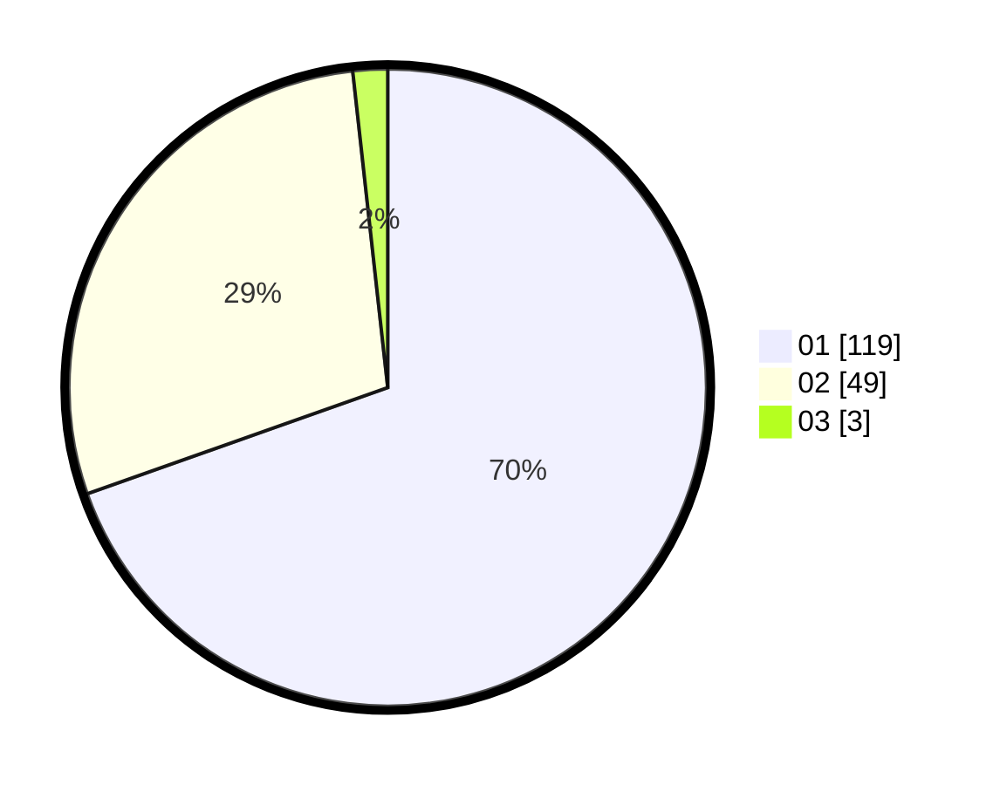

# Hasil

Hasil perolehan suara paslon dapat dilihat pada file paslon-01.txt, paslon-02.txt, dan paslon-03.txt.

Jika tidak ada, artinya data tersebut belum ada pada SIREKAP.

## Perolehan Suara

 * Paslon 01: **119**.
 * Paslon 02: **49**.
 * Paslon 03: **3**.

## Foto C Plano

https://sirekap-obj-formc.kpu.go.id/c366/pemilu/ppwp/31/71/07/10/07/3171071007014-20240214-204045--87c75706-e3cc-48a0-886b-e3a61df0cda7.jpg

https://sirekap-obj-formc.kpu.go.id/c366/pemilu/ppwp/31/71/07/10/07/3171071007014-20240215-161038--9aa41863-466b-42e0-86e0-a2c3ae7c2727.jpg

https://sirekap-obj-formc.kpu.go.id/c366/pemilu/ppwp/31/71/07/10/07/3171071007014-20240214-204226--16a831cb-4251-4ae7-b0db-983746329757.jpg

## DATA PEMILIH TETAP

Jumlah pemilih dalam DPT: **211**.
 * L: **115**.
 * P: **96**.

## DATA PENGGUNA HAK PILIH

Jumlah pengguna hak pilih dalam DPT: **168**.
 * L: **90**.
 * P: **78**.

Jumlah pengguna hak pilih dalam DPTb: **0**.
 * L: **0**.
 * P: **0**.

Jumlah pengguna hak pilih dalam DPK: **4**.
 * L: **1**.
 * P: **3**.

Jumlah pengguna hak pilih: **172**.
 * L: **91**.
 * P: **81**.

## JUMLAH SUARA SAH DAN TIDAK SAH

JUMLAH SELURUH SUARA SAH: **171**.

JUMLAH SUARA TIDAK SAH: **1**.

JUMLAH SELURUH SUARA SAH DAN SUARA TIDAK SAH: **172**.
