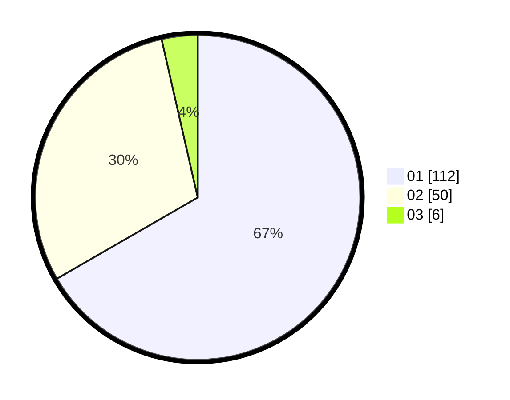

# Hasil

Hasil perolehan suara paslon dapat dilihat pada file paslon-01.txt, paslon-02.txt, dan paslon-03.txt.

Jika tidak ada, artinya data tersebut belum ada pada SIREKAP.

## Perolehan Suara

 * Paslon 01: **112**.
 * Paslon 02: **50**.
 * Paslon 03: **6**.

## Foto C Plano

https://sirekap-obj-formc.kpu.go.id/3740/pemilu/ppwp/31/71/07/10/07/3171071007015-20240214-223216--c8041cbb-a015-4a0f-9867-3cd258e2341f.jpg

https://sirekap-obj-formc.kpu.go.id/3740/pemilu/ppwp/31/71/07/10/07/3171071007015-20240214-223339--8c2461e8-fcd8-4fab-adce-96014b3b6956.jpg

https://sirekap-obj-formc.kpu.go.id/3740/pemilu/ppwp/31/71/07/10/07/3171071007015-20240214-223427--24712038-8751-44c4-b1cb-2d7b9583a576.jpg

## DATA PEMILIH TETAP

Jumlah pemilih dalam DPT: **171**.
 * L: **85**.
 * P: **86**.

## DATA PENGGUNA HAK PILIH

Jumlah pengguna hak pilih dalam DPT: **168**.
 * L: **84**.
 * P: **84**.

Jumlah pengguna hak pilih dalam DPTb: **0**.
 * L: **0**.
 * P: **0**.

Jumlah pengguna hak pilih dalam DPK: **3**.
 * L: **1**.
 * P: **2**.

Jumlah pengguna hak pilih: **171**.
 * L: **85**.
 * P: **86**.

## JUMLAH SUARA SAH DAN TIDAK SAH

JUMLAH SELURUH SUARA SAH: **168**.

JUMLAH SUARA TIDAK SAH: **3**.

JUMLAH SELURUH SUARA SAH DAN SUARA TIDAK SAH: **171**.
