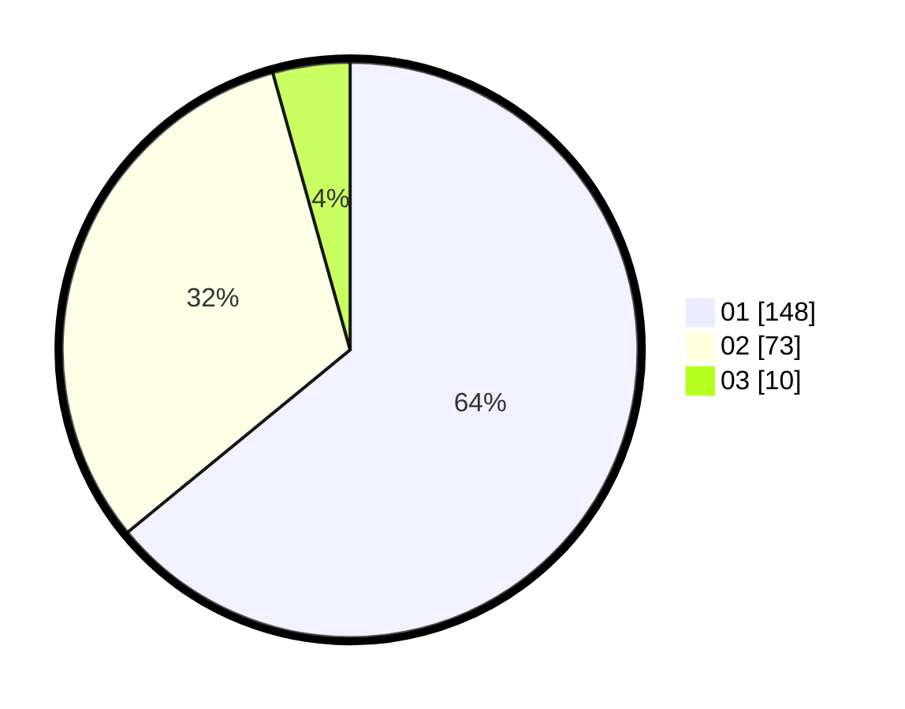

# Hasil

Hasil perolehan suara paslon dapat dilihat pada file paslon-01.txt, paslon-02.txt, dan paslon-03.txt.

Jika tidak ada, artinya data tersebut belum ada pada SIREKAP.

## Perolehan Suara

 * Paslon 01: **148**.
 * Paslon 02: **73**.
 * Paslon 03: **10**.

## Foto C Plano

https://sirekap-obj-formc.kpu.go.id/8afa/pemilu/ppwp/31/71/07/10/07/3171071007025-20240214-195227--015338cd-288f-4c0e-82fa-15047d0b8d3a.jpg

https://sirekap-obj-formc.kpu.go.id/8afa/pemilu/ppwp/31/71/07/10/07/3171071007025-20240214-195257--575599f0-138c-4a08-8bfb-ff34b988f34f.jpg

https://sirekap-obj-formc.kpu.go.id/8afa/pemilu/ppwp/31/71/07/10/07/3171071007025-20240214-195316--d01ea548-1062-45b4-a88e-1d4b9555b4aa.jpg

## DATA PEMILIH TETAP

Jumlah pemilih dalam DPT: **229**.
 * L: **115**.
 * P: **114**.

## DATA PENGGUNA HAK PILIH

Jumlah pengguna hak pilih dalam DPT: **229**.
 * L: **115**.
 * P: **114**.

Jumlah pengguna hak pilih dalam DPTb: **3**.
 * L: **2**.
 * P: **1**.

Jumlah pengguna hak pilih dalam DPK: **1**.
 * L: **1**.
 * P: **0**.

Jumlah pengguna hak pilih: **233**.
 * L: **118**.
 * P: **115**.

## JUMLAH SUARA SAH DAN TIDAK SAH

JUMLAH SELURUH SUARA SAH: **231**.

JUMLAH SUARA TIDAK SAH: **3**.

JUMLAH SELURUH SUARA SAH DAN SUARA TIDAK SAH: **234**.
