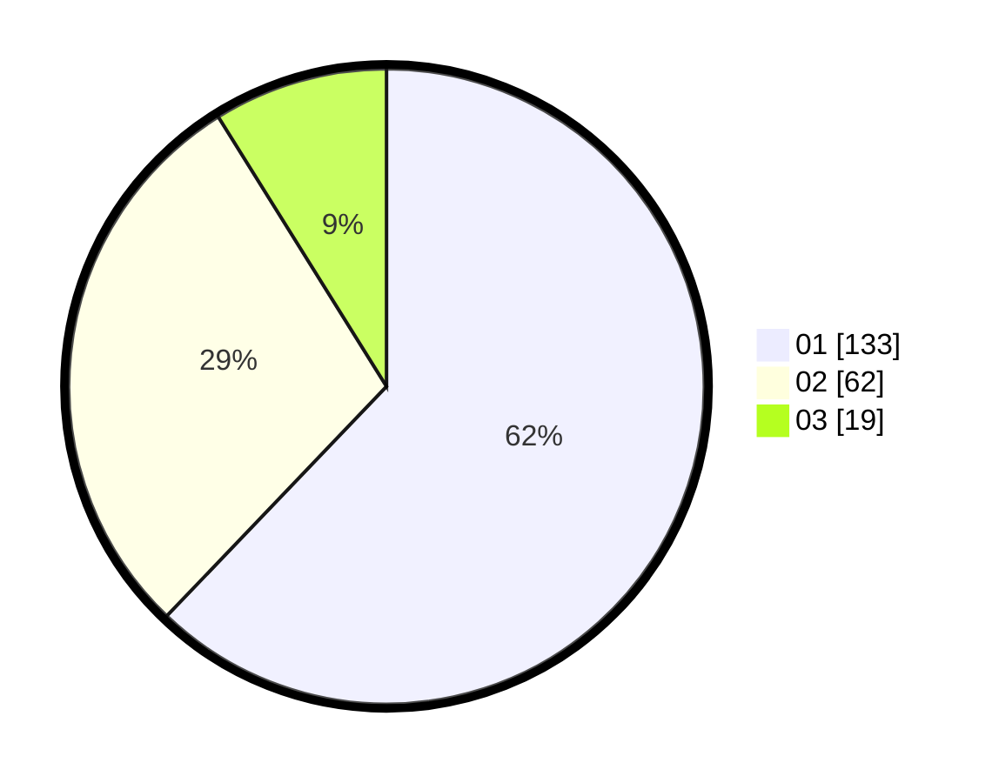

# Hasil

Hasil perolehan suara paslon dapat dilihat pada file paslon-01.txt, paslon-02.txt, dan paslon-03.txt.

Jika tidak ada, artinya data tersebut belum ada pada SIREKAP.

## Perolehan Suara

 * Paslon 01: **133**.
 * Paslon 02: **62**.
 * Paslon 03: **19**.

## Foto C Plano

https://sirekap-obj-formc.kpu.go.id/2848/pemilu/ppwp/31/71/07/10/07/3171071007026-20240214-184912--a348c82c-b5f6-4bdd-a8cc-28595a8877ca.jpg

https://sirekap-obj-formc.kpu.go.id/2848/pemilu/ppwp/31/71/07/10/07/3171071007026-20240214-185239--57071710-69ae-4cae-bec5-10bf709835ca.jpg

https://sirekap-obj-formc.kpu.go.id/2848/pemilu/ppwp/31/71/07/10/07/3171071007026-20240214-185401--b6749d87-f529-4848-b903-ea875f01eeeb.jpg

## DATA PEMILIH TETAP

Jumlah pemilih dalam DPT: **279**.
 * L: **151**.
 * P: **128**.

## DATA PENGGUNA HAK PILIH

Jumlah pengguna hak pilih dalam DPT: **213**.
 * L: **109**.
 * P: **104**.

Jumlah pengguna hak pilih dalam DPTb: **0**.
 * L: **0**.
 * P: **0**.

Jumlah pengguna hak pilih dalam DPK: **6**.
 * L: **3**.
 * P: **3**.

Jumlah pengguna hak pilih: **219**.
 * L: **112**.
 * P: **107**.

## JUMLAH SUARA SAH DAN TIDAK SAH

JUMLAH SELURUH SUARA SAH: **214**.

JUMLAH SUARA TIDAK SAH: **5**.

JUMLAH SELURUH SUARA SAH DAN SUARA TIDAK SAH: **219**.
