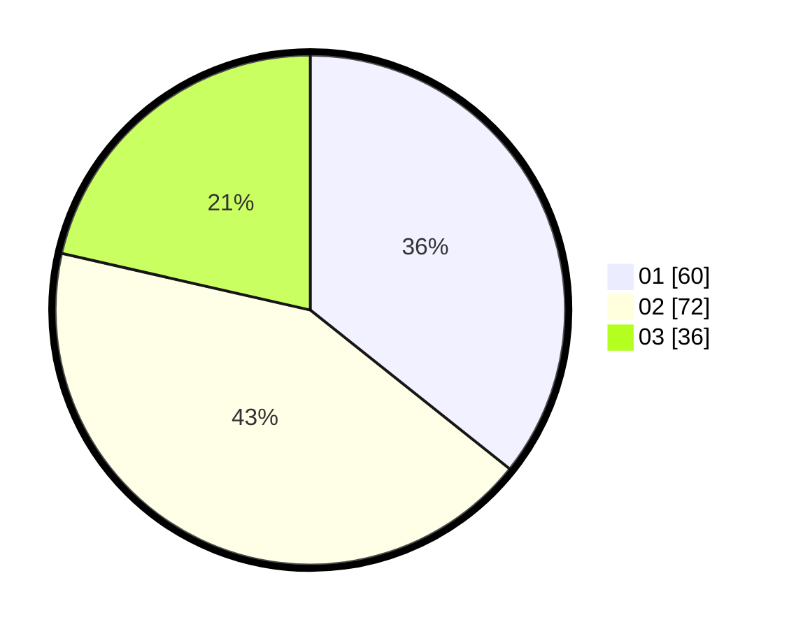

# Hasil

Hasil perolehan suara paslon dapat dilihat pada file paslon-01.txt, paslon-02.txt, dan paslon-03.txt.

Jika tidak ada, artinya data tersebut belum ada pada SIREKAP.

## Perolehan Suara

 * Paslon 01: **60**.
 * Paslon 02: **72**.
 * Paslon 03: **36**.

## Foto C Plano

https://sirekap-obj-formc.kpu.go.id/90e2/pemilu/ppwp/31/71/07/10/07/3171071007031-20240214-230040--106dc404-ceed-4dda-a8b9-29de876f35db.jpg

https://sirekap-obj-formc.kpu.go.id/90e2/pemilu/ppwp/31/71/07/10/07/3171071007031-20240214-230127--c8ab9cf0-f2ce-449b-9d7f-ccd2c106c486.jpg

https://sirekap-obj-formc.kpu.go.id/90e2/pemilu/ppwp/31/71/07/10/07/3171071007031-20240214-230202--6155a28a-ee5b-4d10-aea1-8f030242901e.jpg

## DATA PEMILIH TETAP

Jumlah pemilih dalam DPT: **248**.
 * L: **121**.
 * P: **127**.

## DATA PENGGUNA HAK PILIH

Jumlah pengguna hak pilih dalam DPT: **159**.
 * L: **73**.
 * P: **86**.

Jumlah pengguna hak pilih dalam DPTb: **12**.
 * L: **9**.
 * P: **3**.

Jumlah pengguna hak pilih dalam DPK: **0**.
 * L: **0**.
 * P: **0**.

Jumlah pengguna hak pilih: **171**.
 * L: **82**.
 * P: **89**.

## JUMLAH SUARA SAH DAN TIDAK SAH

JUMLAH SELURUH SUARA SAH: **168**.

JUMLAH SUARA TIDAK SAH: **3**.

JUMLAH SELURUH SUARA SAH DAN SUARA TIDAK SAH: **171**.
