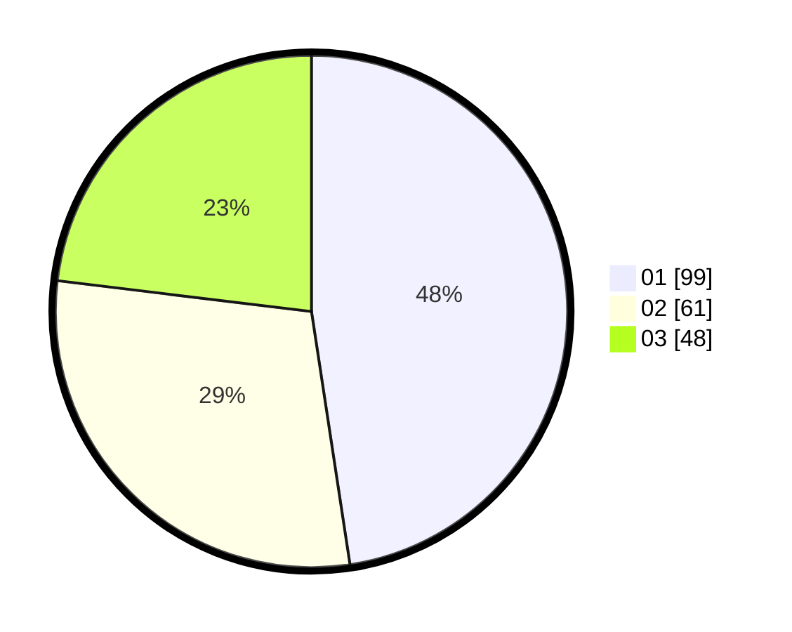

# Hasil

Hasil perolehan suara paslon dapat dilihat pada file paslon-01.txt, paslon-02.txt, dan paslon-03.txt.

Jika tidak ada, artinya data tersebut belum ada pada SIREKAP.

## Perolehan Suara

 * Paslon 01: **99**.
 * Paslon 02: **61**.
 * Paslon 03: **48**.

## Foto C Plano

https://sirekap-obj-formc.kpu.go.id/42eb/pemilu/ppwp/31/71/07/10/07/3171071007037-20240214-212718--c29db987-540f-4899-9a11-eb3defd67c1c.jpg

https://sirekap-obj-formc.kpu.go.id/42eb/pemilu/ppwp/31/71/07/10/07/3171071007037-20240214-212815--3544f71e-fff0-494e-ba5c-b36db97cfae9.jpg

https://sirekap-obj-formc.kpu.go.id/42eb/pemilu/ppwp/31/71/07/10/07/3171071007037-20240214-212854--4452d74c-43c3-4cf2-b33c-93ee5dd7ba47.jpg

## DATA PEMILIH TETAP

Jumlah pemilih dalam DPT: **264**.
 * L: **119**.
 * P: **145**.

## DATA PENGGUNA HAK PILIH

Jumlah pengguna hak pilih dalam DPT: **203**.
 * L: **92**.
 * P: **111**.

Jumlah pengguna hak pilih dalam DPTb: **12**.
 * L: **6**.
 * P: **6**.

Jumlah pengguna hak pilih dalam DPK: **1**.
 * L: **0**.
 * P: **1**.

Jumlah pengguna hak pilih: **216**.
 * L: **98**.
 * P: **118**.

## JUMLAH SUARA SAH DAN TIDAK SAH

JUMLAH SELURUH SUARA SAH: **208**.

JUMLAH SUARA TIDAK SAH: **8**.

JUMLAH SELURUH SUARA SAH DAN SUARA TIDAK SAH: **216**.
