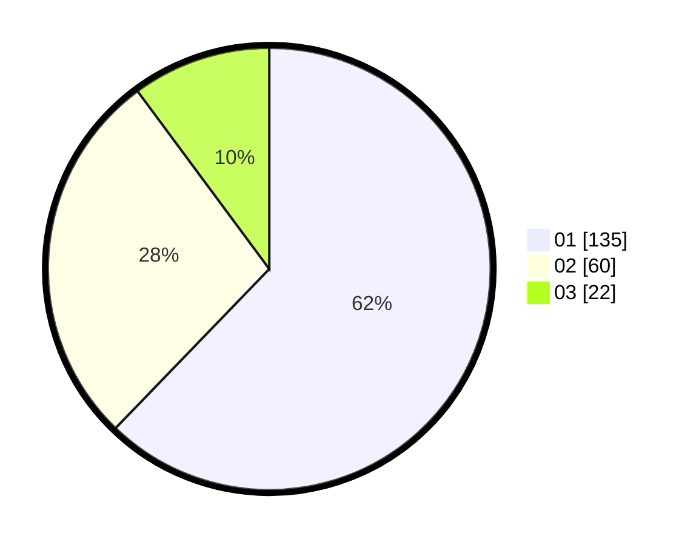

# Hasil

Hasil perolehan suara paslon dapat dilihat pada file paslon-01.txt, paslon-02.txt, dan paslon-03.txt.

Jika tidak ada, artinya data tersebut belum ada pada SIREKAP.

## Perolehan Suara

 * Paslon 01: **135**.
 * Paslon 02: **60**.
 * Paslon 03: **22**.

## Foto C Plano

https://sirekap-obj-formc.kpu.go.id/9ced/pemilu/ppwp/31/71/08/10/01/3171081001002-20240216-144641--63acb126-2e37-4ba8-b496-5b1c61f5548d.jpg

https://sirekap-obj-formc.kpu.go.id/9ced/pemilu/ppwp/31/71/08/10/01/3171081001002-20240216-144642--f2888aae-4590-4274-803d-e6945dd0b6a9.jpg

https://sirekap-obj-formc.kpu.go.id/9ced/pemilu/ppwp/31/71/08/10/01/3171081001002-20240216-144641--ce1eea3e-e3f3-4212-a88f-fcc89cf20523.jpg

## DATA PEMILIH TETAP

Jumlah pemilih dalam DPT: **268**.
 * L: **121**.
 * P: **147**.

## DATA PENGGUNA HAK PILIH

Jumlah pengguna hak pilih dalam DPT: **216**.
 * L: **98**.
 * P: **118**.

Jumlah pengguna hak pilih dalam DPTb: **1**.
 * L: **0**.
 * P: **1**.

Jumlah pengguna hak pilih dalam DPK: **2**.
 * L: **0**.
 * P: **2**.

Jumlah pengguna hak pilih: **219**.
 * L: **98**.
 * P: **121**.

## JUMLAH SUARA SAH DAN TIDAK SAH

JUMLAH SELURUH SUARA SAH: **217**.

JUMLAH SUARA TIDAK SAH: **2**.

JUMLAH SELURUH SUARA SAH DAN SUARA TIDAK SAH: **219**.
