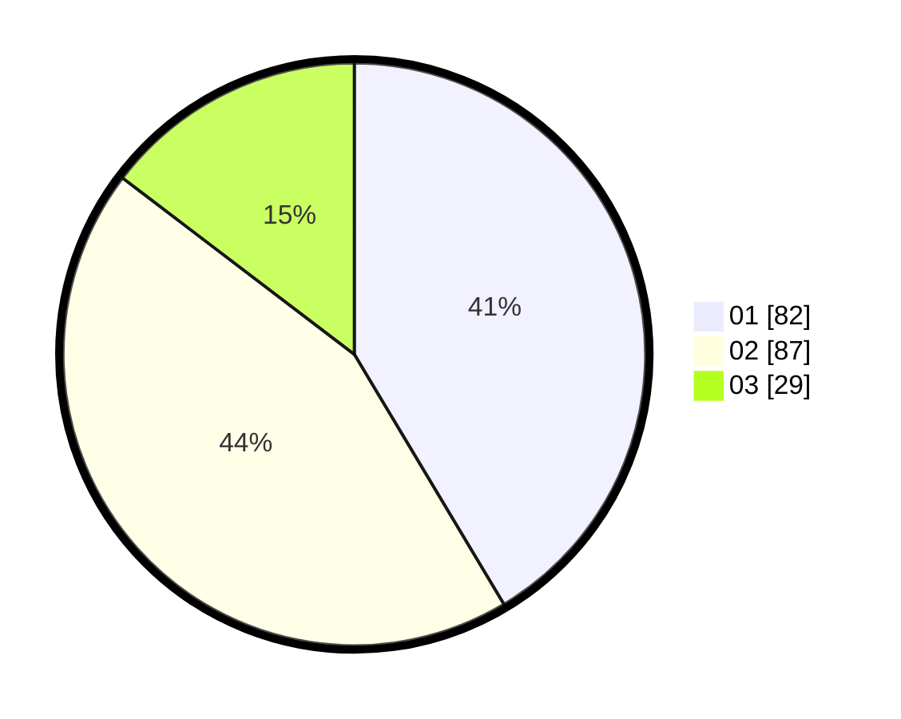

# Hasil

Hasil perolehan suara paslon dapat dilihat pada file paslon-01.txt, paslon-02.txt, dan paslon-03.txt.

Jika tidak ada, artinya data tersebut belum ada pada SIREKAP.

## Perolehan Suara

 * Paslon 01: **82**.
 * Paslon 02: **87**.
 * Paslon 03: **29**.

## Foto C Plano

https://sirekap-obj-formc.kpu.go.id/1161/pemilu/ppwp/31/71/08/10/01/3171081001004-20240216-152454--91b0eff2-aa8c-4ba4-af5f-bf59887c330a.jpg

https://sirekap-obj-formc.kpu.go.id/1161/pemilu/ppwp/31/71/08/10/01/3171081001004-20240216-152456--4e69af16-a855-4f6e-9a7b-a15e12aa1e80.jpg

https://sirekap-obj-formc.kpu.go.id/1161/pemilu/ppwp/31/71/08/10/01/3171081001004-20240216-152455--9a0ab356-793e-4772-8969-3ad36098b7ca.jpg

## DATA PEMILIH TETAP

Jumlah pemilih dalam DPT: **268**.
 * L: **137**.
 * P: **131**.

## DATA PENGGUNA HAK PILIH

Jumlah pengguna hak pilih dalam DPT: **193**.
 * L: **97**.
 * P: **96**.

Jumlah pengguna hak pilih dalam DPTb: **2**.
 * L: **0**.
 * P: **2**.

Jumlah pengguna hak pilih dalam DPK: **3**.
 * L: **1**.
 * P: **2**.

Jumlah pengguna hak pilih: **198**.
 * L: **98**.
 * P: **100**.

## JUMLAH SUARA SAH DAN TIDAK SAH

JUMLAH SELURUH SUARA SAH: **198**.

JUMLAH SUARA TIDAK SAH: **0**.

JUMLAH SELURUH SUARA SAH DAN SUARA TIDAK SAH: **198**.
