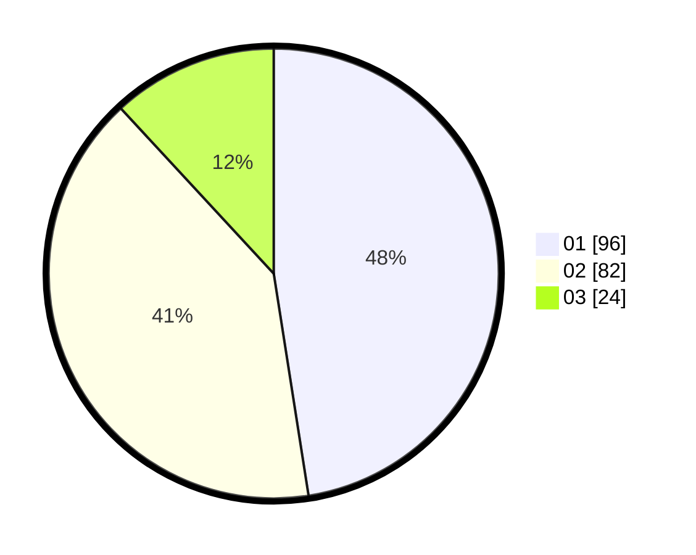

# Hasil

Hasil perolehan suara paslon dapat dilihat pada file paslon-01.txt, paslon-02.txt, dan paslon-03.txt.

Jika tidak ada, artinya data tersebut belum ada pada SIREKAP.

## Perolehan Suara

 * Paslon 01: **96**.
 * Paslon 02: **82**.
 * Paslon 03: **24**.

## Foto C Plano

https://sirekap-obj-formc.kpu.go.id/c487/pemilu/ppwp/31/71/08/10/01/3171081001007-20240216-023353--9f52b773-9ae2-4c86-836e-77678a2e60f3.jpg

https://sirekap-obj-formc.kpu.go.id/c487/pemilu/ppwp/31/71/08/10/01/3171081001007-20240216-023354--e2044ef8-51e7-4fe6-861e-58c5cf0ccdbe.jpg

https://sirekap-obj-formc.kpu.go.id/c487/pemilu/ppwp/31/71/08/10/01/3171081001007-20240216-023354--51cc8c5e-e7e7-4f88-8644-a43d8382fe8f.jpg

## DATA PEMILIH TETAP

Jumlah pemilih dalam DPT: **241**.
 * L: **114**.
 * P: **127**.

## DATA PENGGUNA HAK PILIH

Jumlah pengguna hak pilih dalam DPT: **204**.
 * L: **97**.
 * P: **107**.

Jumlah pengguna hak pilih dalam DPTb: **3**.
 * L: **1**.
 * P: **2**.

Jumlah pengguna hak pilih dalam DPK: **1**.
 * L: **1**.
 * P: **0**.

Jumlah pengguna hak pilih: **208**.
 * L: **99**.
 * P: **109**.

## JUMLAH SUARA SAH DAN TIDAK SAH

JUMLAH SELURUH SUARA SAH: **202**.

JUMLAH SUARA TIDAK SAH: **6**.

JUMLAH SELURUH SUARA SAH DAN SUARA TIDAK SAH: **208**.
