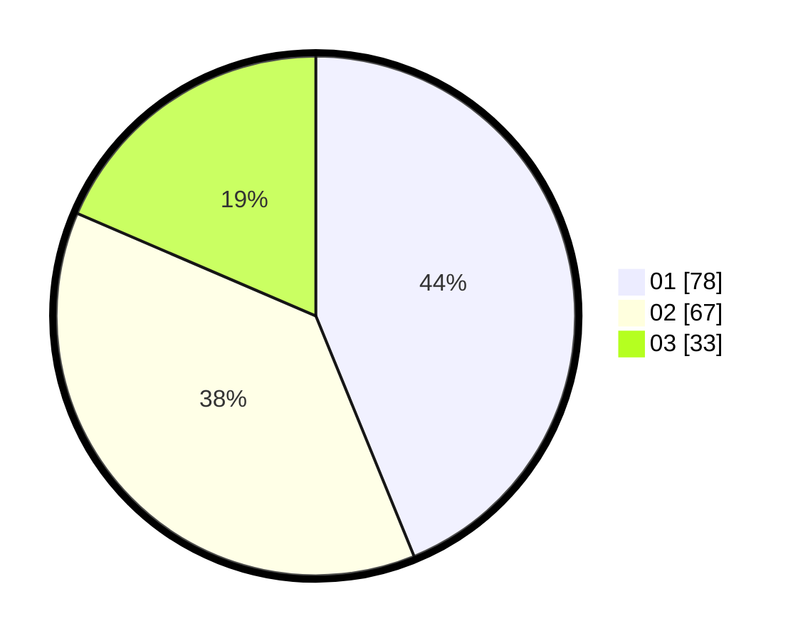

# Hasil

Hasil perolehan suara paslon dapat dilihat pada file paslon-01.txt, paslon-02.txt, dan paslon-03.txt.

Jika tidak ada, artinya data tersebut belum ada pada SIREKAP.

## Perolehan Suara

 * Paslon 01: **78**.
 * Paslon 02: **67**.
 * Paslon 03: **33**.

## Foto C Plano

https://sirekap-obj-formc.kpu.go.id/88f7/pemilu/ppwp/31/71/08/10/01/3171081001009-20240216-145510--c96ee335-4320-41db-b2f4-deb54967ba53.jpg

https://sirekap-obj-formc.kpu.go.id/88f7/pemilu/ppwp/31/71/08/10/01/3171081001009-20240216-145515--91d63a70-c1db-40c2-a6fb-45d32fd72ffe.jpg

https://sirekap-obj-formc.kpu.go.id/88f7/pemilu/ppwp/31/71/08/10/01/3171081001009-20240216-145515--b1cac237-22c8-4b30-85c3-d35c7a7c3d65.jpg

## DATA PEMILIH TETAP

Jumlah pemilih dalam DPT: **258**.
 * L: **139**.
 * P: **119**.

## DATA PENGGUNA HAK PILIH

Jumlah pengguna hak pilih dalam DPT: **182**.
 * L: **91**.
 * P: **91**.

Jumlah pengguna hak pilih dalam DPTb: **0**.
 * L: **0**.
 * P: **0**.

Jumlah pengguna hak pilih dalam DPK: **3**.
 * L: **2**.
 * P: **1**.

Jumlah pengguna hak pilih: **185**.
 * L: **93**.
 * P: **92**.

## JUMLAH SUARA SAH DAN TIDAK SAH

JUMLAH SELURUH SUARA SAH: **178**.

JUMLAH SUARA TIDAK SAH: **7**.

JUMLAH SELURUH SUARA SAH DAN SUARA TIDAK SAH: **185**.
