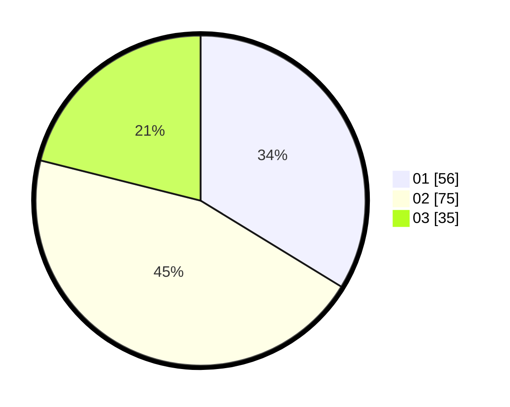

# Hasil

Hasil perolehan suara paslon dapat dilihat pada file paslon-01.txt, paslon-02.txt, dan paslon-03.txt.

Jika tidak ada, artinya data tersebut belum ada pada SIREKAP.

## Perolehan Suara

 * Paslon 01: **56**.
 * Paslon 02: **75**.
 * Paslon 03: **35**.

## Foto C Plano

https://sirekap-obj-formc.kpu.go.id/7cbe/pemilu/ppwp/31/71/08/10/01/3171081001010-20240216-161422--0eacfcee-0897-4a9f-a613-0e209f8e5d63.jpg

https://sirekap-obj-formc.kpu.go.id/7cbe/pemilu/ppwp/31/71/08/10/01/3171081001010-20240216-161423--24c84931-4599-4390-bf80-0c9bf5742310.jpg

https://sirekap-obj-formc.kpu.go.id/7cbe/pemilu/ppwp/31/71/08/10/01/3171081001010-20240216-161422--0243f6fe-6750-4483-846d-ffd9c5358268.jpg

## DATA PEMILIH TETAP

Jumlah pemilih dalam DPT: **226**.
 * L: **112**.
 * P: **114**.

## DATA PENGGUNA HAK PILIH

Jumlah pengguna hak pilih dalam DPT: **168**.
 * L: **80**.
 * P: **88**.

Jumlah pengguna hak pilih dalam DPTb: **0**.
 * L: **0**.
 * P: **0**.

Jumlah pengguna hak pilih dalam DPK: **0**.
 * L: **0**.
 * P: **0**.

Jumlah pengguna hak pilih: **168**.
 * L: **80**.
 * P: **88**.

## JUMLAH SUARA SAH DAN TIDAK SAH

JUMLAH SELURUH SUARA SAH: **166**.

JUMLAH SUARA TIDAK SAH: **2**.

JUMLAH SELURUH SUARA SAH DAN SUARA TIDAK SAH: **168**.
