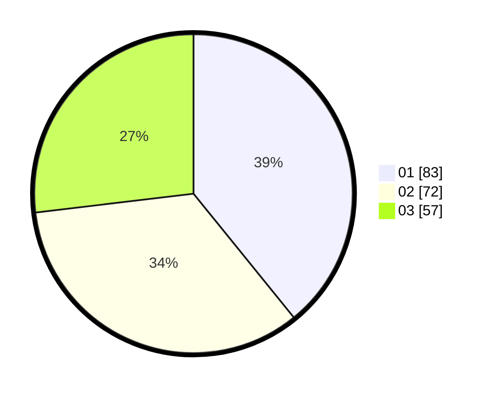

# Hasil

Hasil perolehan suara paslon dapat dilihat pada file paslon-01.txt, paslon-02.txt, dan paslon-03.txt.

Jika tidak ada, artinya data tersebut belum ada pada SIREKAP.

## Perolehan Suara

 * Paslon 01: **83**.
 * Paslon 02: **72**.
 * Paslon 03: **57**.

## Foto C Plano

https://sirekap-obj-formc.kpu.go.id/ac1d/pemilu/ppwp/31/71/08/10/01/3171081001011-20240216-134933--75425f83-d386-403a-9a4a-627d12ac7c55.jpg

https://sirekap-obj-formc.kpu.go.id/ac1d/pemilu/ppwp/31/71/08/10/01/3171081001011-20240216-134934--3aed91bb-b016-4b97-b440-f7c52132f12b.jpg

https://sirekap-obj-formc.kpu.go.id/ac1d/pemilu/ppwp/31/71/08/10/01/3171081001011-20240216-134934--6c5e34fe-ea69-44de-a728-d4b9ee5d3360.jpg

## DATA PEMILIH TETAP

Jumlah pemilih dalam DPT: **275**.
 * L: **133**.
 * P: **142**.

## DATA PENGGUNA HAK PILIH

Jumlah pengguna hak pilih dalam DPT: **202**.
 * L: **92**.
 * P: **110**.

Jumlah pengguna hak pilih dalam DPTb: **3**.
 * L: **1**.
 * P: **2**.

Jumlah pengguna hak pilih dalam DPK: **1**.
 * L: **0**.
 * P: **1**.

Jumlah pengguna hak pilih: **206**.
 * L: **93**.
 * P: **113**.

## JUMLAH SUARA SAH DAN TIDAK SAH

JUMLAH SELURUH SUARA SAH: **212**.

JUMLAH SUARA TIDAK SAH: **6**.

JUMLAH SELURUH SUARA SAH DAN SUARA TIDAK SAH: **218**.
