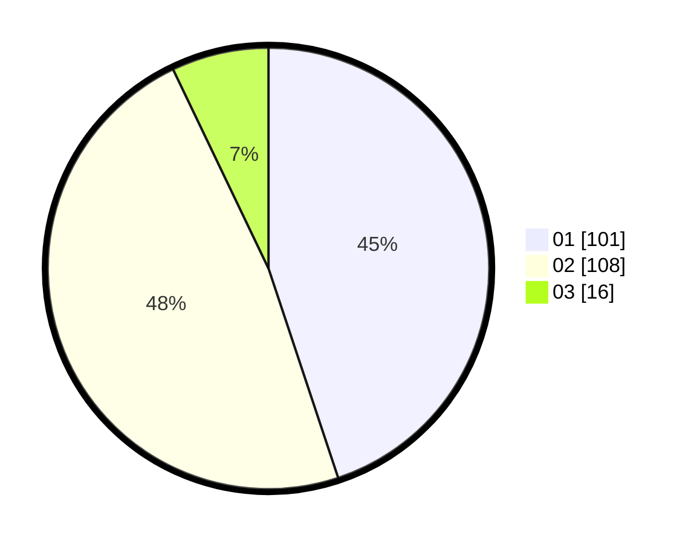

# Hasil

Hasil perolehan suara paslon dapat dilihat pada file paslon-01.txt, paslon-02.txt, dan paslon-03.txt.

Jika tidak ada, artinya data tersebut belum ada pada SIREKAP.

## Perolehan Suara

 * Paslon 01: **101**.
 * Paslon 02: **108**.
 * Paslon 03: **16**.

## Foto C Plano

https://sirekap-obj-formc.kpu.go.id/17de/pemilu/ppwp/31/71/08/10/01/3171081001012-20240216-150854--baa43918-cd35-45ea-b8b2-19216e7de446.jpg

https://sirekap-obj-formc.kpu.go.id/17de/pemilu/ppwp/31/71/08/10/01/3171081001012-20240216-150855--32fb276f-d38e-4f1d-8e61-a6c2ed3b3fe1.jpg

https://sirekap-obj-formc.kpu.go.id/17de/pemilu/ppwp/31/71/08/10/01/3171081001012-20240216-150855--9bada8e3-163b-4695-9a65-89c082ad73c6.jpg

## DATA PEMILIH TETAP

Jumlah pemilih dalam DPT: **269**.
 * L: **139**.
 * P: **130**.

## DATA PENGGUNA HAK PILIH

Jumlah pengguna hak pilih dalam DPT: **223**.
 * L: **109**.
 * P: **114**.

Jumlah pengguna hak pilih dalam DPTb: **4**.
 * L: **3**.
 * P: **1**.

Jumlah pengguna hak pilih dalam DPK: **0**.
 * L: **0**.
 * P: **0**.

Jumlah pengguna hak pilih: **227**.
 * L: **112**.
 * P: **115**.

## JUMLAH SUARA SAH DAN TIDAK SAH

JUMLAH SELURUH SUARA SAH: **225**.

JUMLAH SUARA TIDAK SAH: **2**.

JUMLAH SELURUH SUARA SAH DAN SUARA TIDAK SAH: **227**.
